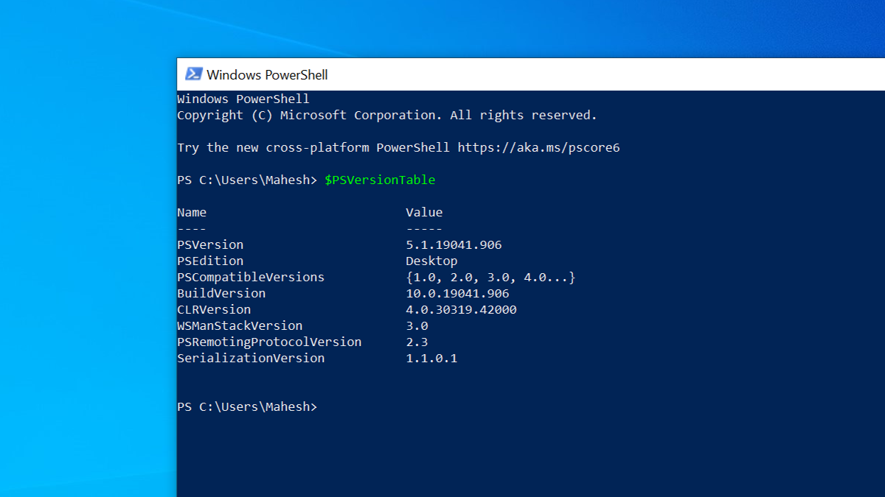
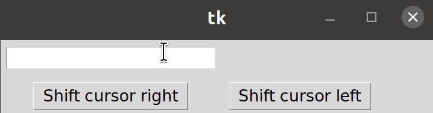
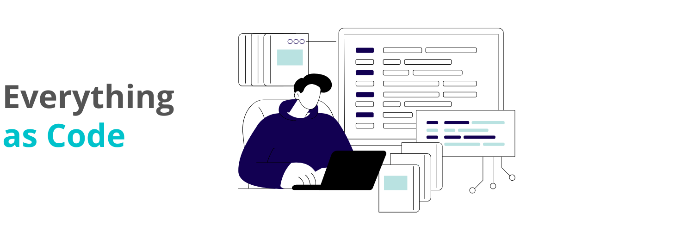
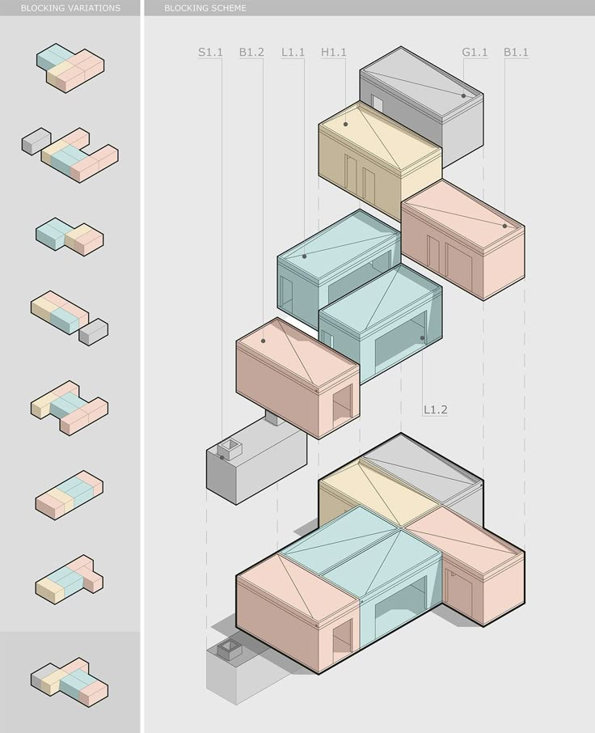
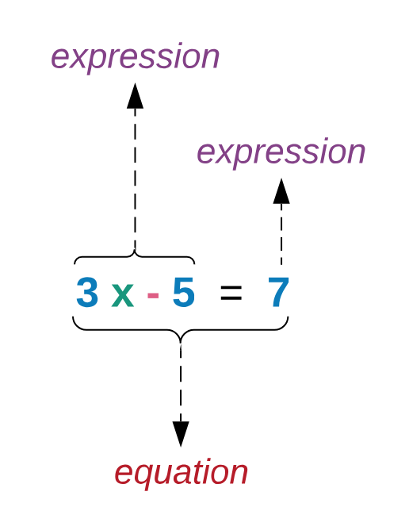

---
theme:
    override:
        code:
            theme_name: railsEnvy
        default:
            colors:
                background: "10141c"
---

<!-- column_layout: [1,1] -->
<!-- column: 0 -->
<!-- jump_to_middle -->
# **Web Applications**       

Mitsiu Alejandro Carreño Sarabia
<!-- column: 1 -->
<!-- jump_to_middle -->


<!-- reset_layout -->
<!-- end_slide -->
Agenda
===
├── Class requirements   
├── Course structure      
├── Math languages    
├── Paradigms    
└── Homework   

<!-- end_slide -->
<!-- jump_to_middle -->
# Class requirements
<!--end_slide -->
# Terminal mastery
The terminal window is a powerfull tool which will allow us to execute commands and programs, `you are required to learn how to use the terminal`
<!-- column_layout: [1,1] -->
<!-- column: 0 -->
CMD 

<!-- column: 1 -->
Powershell

<!-- reset_layout -->
<!-- end_slide -->

# Editor mastery
Most of our time and probably a `significant part of your professional time will be spent at your code editor,` get to know it!
<!-- column_layout: [1,1,1] -->
<!-- column: 0 -->
VsCode

<!-- column: 1 -->
Intellij

<!-- column: 2 -->
NetBeans

<!-- reset_layout -->
<!-- end_slide -->

# Editor mastery
Most of our time and probably a `significant part of your professional time will be spent at your code editor,` get to know it!

- Search in a single file
- Search in multiple files
- Know filename and file path of open file
- Go to definition
- Split screen
- Go to a specific line in a file
- Find and replace in a single/multiple files
<!-- end_slide -->

<!-- jump_to_middle -->
## Course structure   
<!-- end_slide -->
## Shared slides
All this slides will be shared, as well as source code and extra material so here's my recommendation:
- Take hand written notes in a notebook
- Write down definitions
- Write down examples or analogies which makes sense to you
- Write down your interpretation of the lecture

<!-- end_slide -->
## Course materials
Requirements:

**Mandatory:**
- Computer
- Master your source code editor
- Commitment
- Computers ready to share screen (adapters)

**Optional but recommended:**
- Physical notebooks
- Get a lot of tokens
- Disable AI assistants (copilot, chatgpt, etc)
- Disable autocompletion in your editor

<!-- end_slide -->

## Course structure **Partial test**
- `1st Partial = 30%`
- - Class exercise / Homework = 10%
- - Theorical evaluation - Functional paradigm = 20%
- - Theorical evaluation - HTML = 20%
- - Practical evaluation - Functional paradigm (`paper based, NO computer!`) = 25%
- - Practical evaluation - HTML (`paper based, NO computer!`) = 25%
<!-- pause -->
- `2nd Partial = 30%`
- - Class exercise / Homework = 10%
- - Theorical evaluation = 40%
- - Practical evaluation (paper based, NO computer) = 50%
<!-- pause -->
- `3rd Partial = 40%`
- - Theorical evaluation = 40%
- - Practical evaluation (paper based, NO computer) = 60%

<!-- end_slide -->
## Course structure 
I will giveaway `tokens` an in-class currency valued as:
<!-- alignment: center -->
1 token = 0.1 extra in your partial grade 
<!-- alignment: left -->

Tokens are earned by showing interest in the class, this broad concept can be implemented as:
<!-- pause -->
- Answering thoughtfull questions
- Asking thoughtfull questions
- Researching class-related topics
- Teaching/expaining to other classmates
- Specific in-class activities
- Showing mastery at activities
 
<!-- end_slide -->
## My setup
I personally prefer text-based rather than graphical interfaces, it's faster!
<!-- column_layout: [1,1] -->
<!-- column: 0 -->
* Mis-clicks
* Loose the cursor
* Time spent to move coursor
<!-- column: 1 -->

<!-- reset_layout -->
You can use any editor or environment which suits you, I encourage you to `learn your tools` so you can set them up for your use and confort.
<!-- end_slide -->

## My setup
But in case of wonder here's a quick overview of my setup:

<!-- column_layout: [1,1] -->
<!-- column: 0 -->
OS: Fedora/Gnome (Ownership)
[](https://fedoraproject.org/)

<!-- column: 1 -->
Terminal: Kitty (Multiplexer)
[](https://sw.kovidgoyal.net/kitty/)

<!-- reset_layout -->
<!-- end_slide -->
## My setup
But in case of wonder here's a quick overview of my setup:

<!-- column_layout: [1,2] -->
<!-- column: 0 -->
Editor: Neovim (Fast)
[](https://neovim.io/)

<!-- column: 1 -->
Slides: Presenterm (Slides as code)
[](https://github.com/mfontanini/presenterm)

<!-- reset_layout -->
<!-- end_slide -->

## Wellness
The things you will learn in this class are important, but remember that **it's just a class**. If you're sleeping 4 hours at night, skipping meals or otherwise compromising your health for the sake of this class, **something is wrong**.

Take care of yourself if you are experiencing difficulties, dont hesitate to reach out **talk to me**. I am a **full-time professor and can find my at my cubicule.** 

Let's make a plan to help you succeed.
<!-- end_slide -->

## Course intro      
- Why this career?
<!-- pause -->
- Do you enjoy writting code?
<!-- pause -->
- Which is the most complex program you've written?
<!-- pause -->
- Which programming languages do you know? Favourite?
<!-- pause -->
- Which editor/tools do you use to write code?
<!-- pause -->
- Do you know what git is?
<!-- pause -->
- Which Operating system do you use?
<!-- pause -->
- Which Operating system did you use on yout OS class last quarter?
<!-- pause -->
- What's your opinion on tech certificates?
<!-- pause -->
- `Do you enjoy reading?` (Not limited to books)
<!-- pause -->
- To whom do you write code to?
<!-- pause -->
- Did you enjoy your OOP course?
<!-- end_slide -->

<!-- jump_to_middle -->
### Math language
<!-- end_slide -->


### What is programming?
<!-- pause -->
Programming is the act of **instructing a computer on how to achieve some kind of operation.**

<!-- new_line -->
Programming is **inherently a communicative act.**

<!-- new_line -->
**Instructing** is the key word. Good communication exists, so what is good programming?

<!-- end_slide -->
### Modularity
Good programming should be **modular.**
<!-- column_layout: [1,1] -->
<!-- column: 0 -->
Logically distinct parts should be separated, for separate maintenance and reuse.
<!-- new_line -->
You should be able to think about a single area of a codebase without needing to concern yourself with unrelated logic.
<!-- column: 1 -->

<!-- reset_layout -->
<!-- end_slide -->

### Modularity
Good programming should be **modular.**
<!-- column_layout: [1,1] -->
<!-- column: 0 -->
Let's suppose we are writting a program to buy items online, why developing the payment processing module, we shouldn't be concerned about authentication!

Programs grow in complexity at an impressive rate, our memory can't keep up.
<!-- column: 1 -->

<!-- reset_layout -->
<!-- end_slide -->
### Maintainability
<!-- column_layout: [1,1] -->
<!-- column: 0 -->
Good programming should be **maintainable.**

Programs should be written with future maintainability in mind.

Code written expressively, and has future expansion in mind, will be easiest to maintain.

We write code for our future selfs, for our development team and lastly for the computer.
<!-- column: 1 -->

<!-- reset_layout -->
<!-- end_slide -->

### Math language (Values and expressions)
> Expression: Combination of one or more constants, variables, functions, and operators     
```latex +render
\[ 5 + 2 \]
```
Expressions can often be **simplified or evaluated**.
<!-- pause -->
```latex +render
\[ 5 + 2 \Longrightarrow 7 \]
```
> Value: The result of a calculation (a **final answer** that cannot be simplified further)      
<!-- end_slide -->
### Math language (Values and expressions)
We use the 
```latex +render
\[ \Longrightarrow \]
```
simbol to denote `stepping` (or `reducing`) of expressions, which means to simplify an expression by one step.
<!-- end_slide -->

### Math language (Values and expressions)
<!-- column_layout: [1,2] -->
<!-- column: 0 -->
```latex +render +width:50%
\[ (5 + 2) * 3 \]
```
Let's evaluate this expression:
<!-- pause -->
```latex +render
\begin{align}
(5 + 2) * 3 &\Longrightarrow 7 * 3 \\
            &\Longrightarrow 21
\end{align}
```
<!-- column: 1 -->
<!-- pause -->
> Expression: Combination of one or more constants, variables, functions, and operators     

> Value: The result of a calculation (a **final answer** that cannot be simplified further)      
<!-- pause -->
```latex +render
\begin{table}[]
\begin{tabular}{lll}
Math & Expression  & Value \\
\[ (5 + 2) * 3 \] & ✅ &  ❌ \\ 
\[ 7 * 3 \] & ✅ &  ❌ \\ 
\[ 21 \] & ✅ & ✅ \\ 
\end{tabular}
\end{table}
```
`Values are expressions!`

<!-- reset_layout -->
<!-- end_slide -->
### Math language (Values and expressions)
`Values are expressions!`    
It's a mathematical phrase, just a very simple one.
```latex +render
21 \\
3 \\
-4
```
<!-- end_slide -->
### Math language (Values and expressions)
Let's analyse an expression a little bit harder:
<!-- column_layout: [1,1] -->
<!-- column: 0 -->

<!-- column: 1 -->
Since **x** is a variable, it's value will also change depending on the context of a problem.
<!-- new_line -->
What's the value if **x = 2**?
<!-- new_line -->
Also we can put a constraint on **x**
<!-- reset_layout -->
<!-- end_slide -->

### Math language (Values and expressions)
Also we can put a constraint on **x**
<!-- column_layout: [1,1] -->
<!-- column: 0 -->

<!-- column: 1 -->
The expression on the left must evaluate to 7.
<!-- new_line -->
What are the possible values **x** can assume?
<!-- reset_layout -->
<!-- end_slide -->

### Math language (Values and expressions)
What happens if we try to evaluate:
```latex +render +width:50%

\begin{align}
(5 + 2) * 3x = (4 + 3) * x
\end{align}
```
<!-- pause -->
```latex +render
\begin{align}
(5 + 2) * 3x = (4 + 3) * x &\Longrightarrow 7 * 3x = 7 * x \\
            &\Longrightarrow 21x = 7x \\
            &\Longrightarrow 21x - 7x = 0 \\
            &\Longrightarrow 14x = 0 \\
            &\Longrightarrow x = 0

\end{align}
```
<!-- end_slide -->
### Math language (Values and expressions)
<!-- new_line -->
Math gives us this clear and concise language, with clear rules and simbols.
<!-- new_line -->
<!-- column_layout: [1,2] -->
<!-- column: 0 -->
```latex +render
\begin{align}
(5 + 2) * 3 &\Longrightarrow 7 * 3 \\
            &\Longrightarrow 21
\end{align}
```
<!-- column: 1 -->
```latex +render
\begin{align}
(5 + 2) * 3x = (4 + 3) * x &\Longrightarrow 7 * 3x = 7 * x \\
            &\Longrightarrow 21x = 7x \\
            &\Longrightarrow 21x - 7x = 0 \\
            &\Longrightarrow 14x = 0 \\
            &\Longrightarrow x = 0

\end{align}
```
<!-- reset_layout -->
<!-- end_slide -->

### Math language (Values and expressions)
Finally let's try to evaluate:
```latex +render
\begin{align}
x = x + 1
\end{align}
```
<!-- pause -->
```latex +render
\begin{align}
x = x + 1 &\Longrightarrow x - x = 1 \\
            &\Longrightarrow 0 = 1 \\
            &\Longrightarrow 🤯
\end{align}
```
This equation is a **contradiction**
<!-- end_slide -->
<!-- jump_to_middle -->
#### Paradigms
<!-- end_slide -->

#### A tale of two equals
<!-- column_layout: [1,1] -->
<!-- column: 0 -->
```latex +render
\begin{align}
x = x + 1
\end{align}
```
<!-- column: 1 -->
In math equals means equality the left expression has to evaluate to the same value that the right expression.
<!-- reset_layout -->
<!-- pause -->
<!-- column_layout: [1,1] -->
<!-- column: 0 -->
Yet we use it often while programming, for example check this java code:
```java +line_numbers
int x = 0;
for (int i = 0; i < 5; i++){
    x = x + 1;  <------
}
```
<!-- column: 1 -->
<!-- pause -->
In `imperative programs` equals means an assignment; x is now equal to the previous value of x and we have added to it.
<!-- new_line -->
Double equals does check for equality
which evaluates to true or false.
<!-- reset_layout -->
<!-- end_slide -->
#### Imperative programming
Let's revisit our Java snippet
```java +line_numbers
int x = 0;
for (int i = 0; i < 5; i++){
    x = x + 1;
}
```
When we instruct **x = x + 1;** we are changing the `state` of our program.     
x has a new value, we change the world, from one where x was 0, to be one where x is 1.    
<!-- end_slide -->

#### Imperative programming
```java +line_numbers
int x = 0;
for (int i = 0; i < 5; i++){
    x = x + 1;  
}
```
Imagine we are tracking a bug that occurs in line 3, this is problematic because, understanding a programs entails `not only understanding what the code does, but knowing the entire history of the program up until that point.` 
<!-- end_slide -->
#### Imperative programming
Let's look at other example of non-functional code in Java:
<!-- column_layout: [1,1] -->
<!-- column: 0 -->
```java +line_numbers 
class Inc {
  static int count = 0;

  static int increment(){
    count +=1;

    return count;
  }
}
```
<!-- column: 1 -->
If i call `Inc.increment()` what does it return?
<!-- pause -->
The answer: **it depends**. On the first call, it returns 1, on the second call, 2 and so on.
<!-- reset_layout -->
<!-- end_slide -->

#### State
Previously we mentioned:
<!-- column_layout: [1,1] -->
<!-- column: 0 -->
```java +line_numbers
int x = 0;
for (int i = 0; i < 5; i++){
    x = x + 1;
}
```
<!-- column: 1 -->
When we instruct **x = x + 1;** we are changing the `state` of our program.     
x has a new value, we change the world, from one where x was 0, to be one where x is 1.    
<!-- reset_layout -->
A computer program stores data in variables, which represent storage locations in the computers memory. The contents of these memory locations, at any given point in the program execution, are called `the program state.`
<!-- end_slide -->
#### State
Usually state is represented as:
<!-- column_layout: [1,1] -->
<!-- column: 0 -->

Credit: Transcode     
https://www.youtube.com/watch?v=ghCbURMWBD8
<!-- column: 1 -->
This approach lead to several interesting situations:
- A box might be empty
- The box contents can change at any time
<!-- end_slide -->

#### State

This behaviour can be found in the real world:

1. Search for me in my office
- - I might or not be at my office
- - My office has certain schedule that changes every academic cycle
2. Want to use a univerity bathroom stall
- - The bathroom might be occupied or not
- - The bathroom might be closed by the cleaning services
- - The bathroom sink might have no water

The `state` is unpredictable because there are several processes that modify its `state`.
<!-- end_slide -->

#### State
It's such a hassle we always have to verify the state, make sure we can proceed, wouldn't it be great if we have a single bathroom stall (or teacher) exclusive for us?

Which `state` is always available for us.

<!-- end_slide -->

#### (Recap) A new paradigm      
**Programming paradigm**
1. A high level model to `conceptualize and structure` a computer program implementation 

Which programming paradigms do you know?
<!-- pause -->
Which rules and structures does object oriented paradigm enforce?
<!-- end_slide -->

#### Functional paradigm
In this course we will be learning **the functional paradigm** where we avoid modification of state.
Functional programming is **an improvement on our ability to communicate as programmers.**

<!-- column_layout: [1,1] -->
<!-- column: 0 -->
Programming, Imperatively

Computation by **modifying the computer's state**

```
x = 2;
x + x
```
<!-- column: 1 -->

Programming, Functionally

Computation by **reduction of expressons to values**
```elm
2 + 2
```

<!-- reset_layout -->
<!-- end_slide -->
#### State
In statefull programs, we use commands like **x = 2** to change the word, to be one where x + x is 4.
This doesn't stop another part ot the program to change the value of x and re-compute the result:
```
x = 2;
x = 5;
x + x
```

In functional programs, we apply simplifying rules to expressions like 2 + 2, to obtain the value of 4

These expressions are **disjoint**, in that evaluation of one expression is unrelated to the evaluation of another.

<!-- end_slide -->

#### Last word
Functional programming allows reasoning about programs and their subcomponents in the same way that you would reason about a mathematical expression.

We’re not just in the business of writing code, but correct code!
<!-- end_slide -->

<!-- jump_to_middle -->
##### Homework
<!-- end_slide -->

##### Homework
**1. Bring your computer next session**       
<!-- pause -->
**2. Master your terminal:**
- `cd <path>` Change to a specific directory
- `cd ..` Go to parent directory 
- `pwd` Print current directory 
<!-- pause -->
**3. Master your code editor:**
<!-- column_layout: [1,1] -->
<!-- column: 0 -->
- Search in a single file
- Search in multiple files
- Know filename and file path of open file
- Go to definition
<!-- column: 1 -->
- Split screen
- Go to a specific line in a file
- Find and replace in a single/multiple files
<!-- reset_layout -->
<!-- end_slide -->
##### Homework
**4. Master your keyword**
- How to keypress () [] {}
- https://monkeytype.com/
- Practice PascalCase with shift key

**5. Upskill your english**
