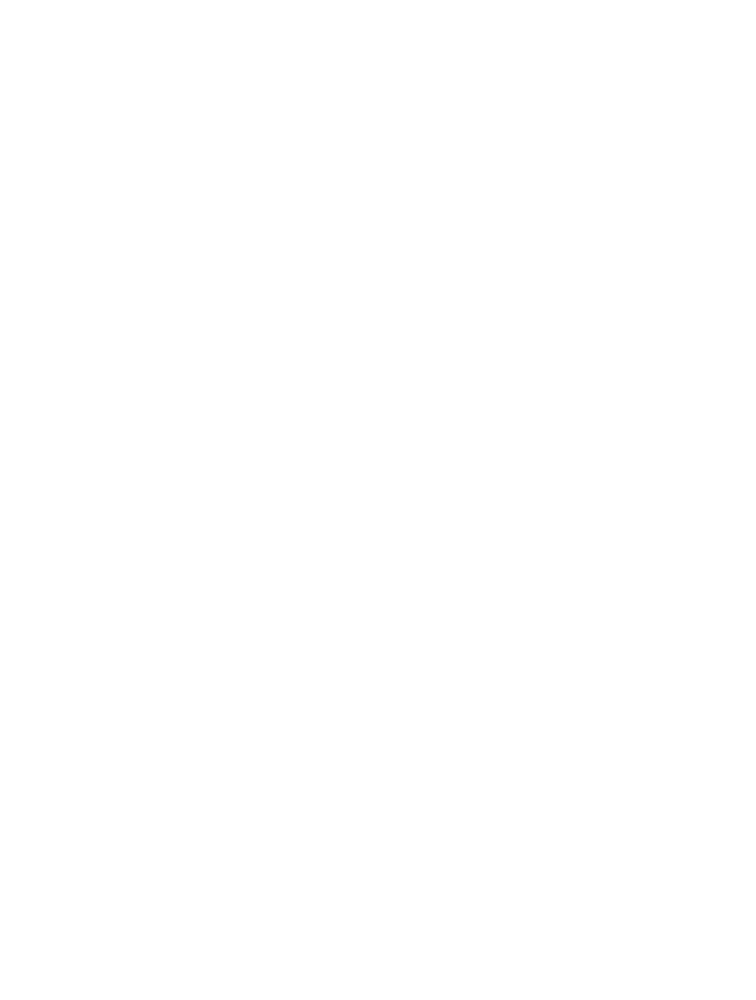

---
theme:
    override:
        code:
            theme_name: railsEnvy
        default:
            colors:
                background: "10141c"
---

<!-- column_layout: [1,1] -->
<!-- column: 0 -->
<!-- jump_to_middle -->
# **Data types**       

Mitsiu Alejandro Carreño Sarabia
<!-- column: 1 -->
<!-- jump_to_middle -->


<!-- reset_layout -->
<!-- end_slide -->
Agenda
===
├── Recap   
├── Types      
├── Functions    
├── Installation    
└── Homework   

<!-- end_slide -->

<!-- jump_to_middle -->
# Recap
<!--end_slide -->

# Recap
- What is an expression?
<!-- pause -->
- What is a value?
<!-- pause -->
- What does this simbol means?
```latex +render
\[ \Longrightarrow \]
```
<!-- pause -->
- Values are expressions?
<!-- pause -->
- Expressions are values?
<!-- pause -->
- What is imperative programming?
<!-- pause -->
- What is state in computer science?

<!-- end_slide -->

# Homework
**1. Bring your computer next session**       
<!-- pause -->
**2. Master your terminal:**    
- Change to a specific directory
- Go to parent directory 
- Print current directory 
<!-- pause -->
**3. Master your code editor:**
<!-- column_layout: [1,1] -->
<!-- column: 0 -->
- Search in a single file
- Search in multiple files
- Know filename and file path of open file
- Go to definition
<!-- column: 1 -->
- Split screen
- Go to a specific line in a file
- Find and replace in a single/multiple files
<!-- reset_layout -->
<!-- end_slide -->
# Homework
**4. Master your keyword**
- How to keypress () [] {}
- https://monkeytype.com/
- Practice PascalCase with shift key
<!-- end_slide -->

# Functional programming
Functional programming allows reasoning about programs and their subcomponents in the same way that you would reason about a mathematical expression.

We’re not just in the business of writing code, but correct code!
<!-- end_slide -->

<!-- jump_to_middle -->
## Types
<!--end_slide -->

## Types guide structure (shape)
Functional programming places a great emphasis on types, which serve the purpose of documenting the purpose of code, and restricting the range of behaviors that a program is allowed to exhibit.

In this way, `types guide the structure of a program`, by providing clean interfaces for how different parts should interact, and what it should be allowed to do.
<!--end_slide -->
## Data types
We will be using a functional programming language called **Elm** which support the following data types:
<!-- column_layout: [2,1] -->
<!-- column: 0 -->

<!-- column: 1 -->

<!-- reset_layout -->
<!-- end_slide -->

## Data types
> Type: Is a specification of the behavior of a piece of code. It **predicts** what a program is allowed to do.

To say that an expression e has type t we write:
```latex +render
\[ e : t \]
```
For example:
```latex +render +width:30%
\[ (5 + 2) * 3 : number \]
```
We are communicating that the expression (5 + 2) * 3 must produce a value of type number (either Int or Float)

<!-- end_slide -->
## Data types
Tracing back our value definition:
> Value: The result of a calculation (a **final answer** that cannot be simplified further)      

We can exemplify **values** for each data type:
```latex +render
\begin{align}
True &: Bool \\
1 &: Int \\
3.14 &: Float \\ 
'a' &: Char \\
''abc'' &: String
\end{align}
```
"abc" : String 
<!-- end_slide -->

## Data types & operators
Elm is a `statically typed` language, meaning that all typing rules are applied `before the program is ever run`
Let's analyze how Elm enforces it's type rules:

```latex +render +width:20%
\[ (5 + 2) * 3 : number \]
```
<!-- column_layout: [1,1,1] -->
<!-- column: 0 -->
The typing rule for **+** is:
```latex +render
\begin{align}
e1 + e2 &: number \\
if \\
e1 &: number \\
and \\
e2 &: number
\end{align}
```
<!-- pause -->
<!-- column: 1 -->
We know
```latex +render
\begin{align}
5 &: Int \\
and \\
2 &: Int \\
so \\
5 + 2 &: Int
\end{align}
```
<!-- pause -->
<!-- column: 2 -->
The typing rule for **\*** is:
```latex +render
\begin{align}
e1 * e2 &: number \\
if \\
e1 &: number \\
and \\
e2 &: number
\end{align}
```
<!-- reset_layout -->
<!-- end_slide -->
## Data types & operators
Now lets learn a new operator **++** 
<!-- pause -->
<!-- column_layout: [1,2] -->
<!-- column: 0 -->
The typing rule for **++** is:
```latex +render
\begin{align}
e1 ++  e2 &: appendable \\
if \\
e1 &: appendable \\
and \\
e2 &: appendable
\end{align}
```
<!-- column: 1 -->

Anyone can figure out a valid expression with **++**?
<!-- reset_layout -->

<!-- end_slide -->
## Data types & operators
```latex +render
\begin{align}
''Hello''  : String++  ''world'' &: String \Longrightarrow \\
''Helloworld'' &: String 
\end{align}
```

<!-- end_slide -->

## Data types & operators
Finally let's analyze the expression:
```latex +render +width:35%
\begin{align}
''Hello'' ++ 2 \\
''Hello'' ++ 2 :& appendable \\
if \\
''Hello'' :& appendable ✅\\
and \\
2 :& appendable ❌
\end{align}
```
<!-- pause -->
So "Hello" ++ 2 does not have a type, and we say it's an `ill-typed expression`
**Ill-typed programs are not evaluated**
<!-- end_slide -->
## Variables
In elm we can create variables just by giving a name and binding a value:
```elm
myName = "Mitsiu"
```
Elm response is:
Mitsiu : String
But let's look what happens if we try with a numerical value
<!-- end_slide -->
## Data types & operators
Elm is unable to determine "age" type with certainty, it can be:
- A float that happens to have no decimal
- An integer

Let's improve our communication hability:
```elm +line_numbers
age : Int
age = 32
```

Line 1 is a type annotation it help's auto-document our code and clears all ambiguity about our true intent.

<!-- end_slide -->

<!-- jump_to_middle -->
### Functions       
<!-- end_slide -->

### Functions
In math we find:

<!-- column_layout: [1,1] -->
<!-- column: 0 -->
```latex +render +width:35%
\begin{align}
f(x) = 2 * x
\end{align}
```
<!-- pause -->
- f is the name of the function
- f(x) the function f has an input x 
- = 2 * x describe what the function does
<!-- pause -->
<!-- column: 1 -->

<!-- reset_layout -->
<!-- end_slide -->
### Functions & Data types
Let's dig deeper into our function

<!-- column_layout: [1,1] -->
<!-- column: 0 -->
```latex +render +width:35%
\begin{align}
f(x) = 2 * x
\end{align}
```
- f is the name of the function
- f(x) the function f has an input x 
- = 2 * x describe what the function does
<!-- pause -->
<!-- column: 1 -->
The typing rule for **\*** is:
```latex +render
\begin{align}
e1 * e2 &: number \\
if \\
e1 &: number \\
and \\
e2 &: number
\end{align}
```
<!-- reset_layout -->
What can be inferred about the input and output of our function f?
<!-- end_slide -->

### Functions & Data types
```latex +render +width:20%
\begin{align}
f(x) = 2 * x
\end{align}
```
- Which data types can "x" be?
- Which data types can the output be?
<!-- end_slide -->
### Functions definition & Data types
```latex +render +width:20%
\begin{align}
f(x) = 2 * x
\end{align}
```
Let's start to code our first function in elm
First our type annotation
```elm +line_numbers
f : number -> number
```
The function parameter has type number and the function returns a number
<!-- pause -->
Then our function body
```elm +line_numbers
f : number -> number
f x = 
    2 * x
```
<!-- end_slide -->

### Function application
To use the functions we just defined, we have to `apply` it. 
1. We specify the function to apply by it's name
2. We have to provide a value for the input "x"
<!-- column_layout: [1,1] -->
<!-- column: 0 -->
```elm +line_numbers
-- Function definition
f : number -> number
f x = 
    2 * x

-- Function application
f 4
```
<!-- column: 1 -->
So we would have that 
```latex +render
\[ f 4 \Longrightarrow  8 \]
```
<!-- reset_layout -->
<!-- end_slide -->
