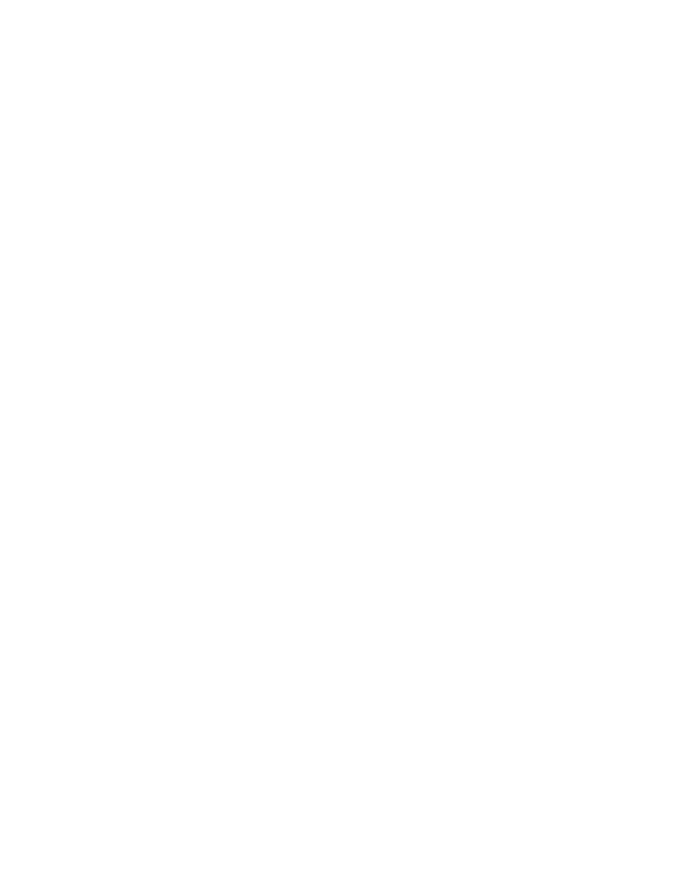
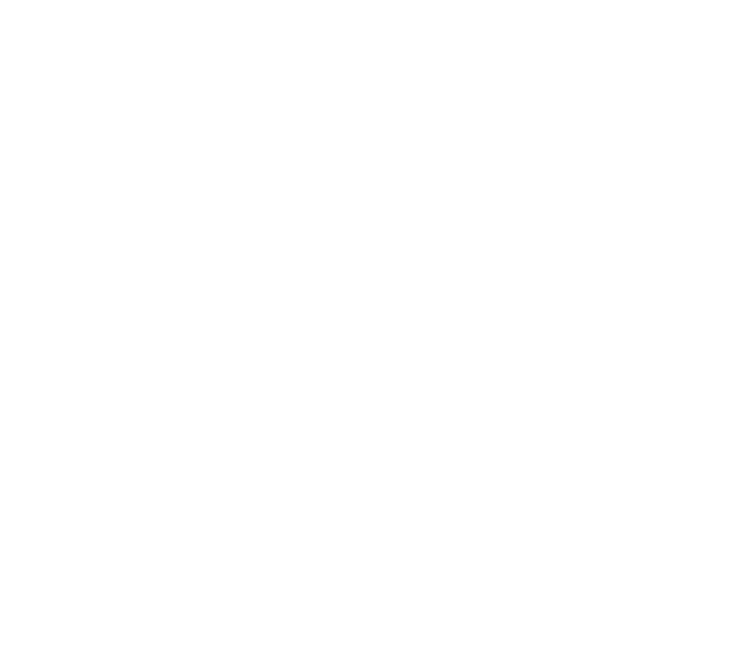
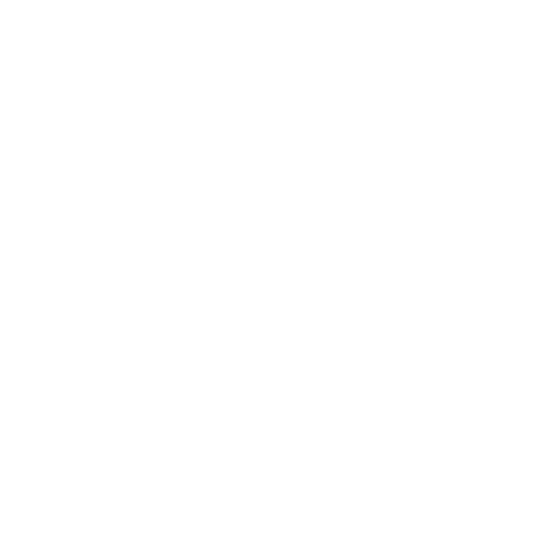

---
theme:
    override:
        code:
            theme_name: railsEnvy
        default:
            colors:
                background: "10141c"
---

<!-- column_layout: [1,1] -->
<!-- column: 0 -->
<!-- jump_to_middle -->
# **Functions**       

Mitsiu Alejandro Carreño Sarabia
<!-- column: 1 -->
<!-- jump_to_middle -->

<!-- reset_layout -->
<!-- end_slide -->
Agenda
===
├── Recap   
├── Functions      
├── First project      
├── If    
├── Case    
├── Microslop      
├── Formatter & clean code    
└── Homework

<!-- end_slide -->
<!-- jump_to_middle -->
# Recap
<!-- end_slide -->
# Course changes
- 1st Partial = 30%
- - Class exercise / Homework = 10%
- - Theorical evaluation - Functional paradigm = 20%
- - Theorical evaluation - HTML = 20%
- - Practical evaluation - Functional paradigm (paper based, NO computer!) = 25%
- - Practical evaluation - HTML (paper based, NO computer!) = 25%
<!-- pause -->
- 2nd Partial = 30%
- - Class exercise / Homework = 10%
- - Theorical evaluation = 40%
- - Practical evaluation (`maybe in` computer) = 50%
<!-- pause -->
- 3rd Partial = 40%
- - `Theorical evaluation` - Client-Server = `30%`
- - `Theorical evaluation` - side effects = `30%`
- - Practical evaluation (`in` computer) = `40%`

<!-- end_slide -->
# Recap 
- What is an expression?
<!-- pause -->
- What is a value?
<!-- pause -->
- What does this simbol means?
```latex +render
\[ \Longrightarrow \]
```
<!-- pause -->
- Values are expressions?
<!-- pause -->
- Expressions are values?
<!-- pause -->
- What is imperative programming?
<!-- pause -->
- What is state in computer science?
<!-- pause -->
- Which primitive data types exist in elm?
<!-- pause -->
- Exemplify 3 non-Int values
<!-- pause -->
- Which conditions does the (+) operator has? 
<!-- end_slide -->

<!-- jump_to_middle -->
## Functions       
<!-- end_slide -->
## Variables
In elm we can create variables just by giving a name and binding a value:
```elm
myName = "Mitsiu"
```
Elm response is:
Mitsiu : String    
<!-- new_line -->
But let's look what happens if we try with a numerical value
<!-- pause -->
Elm is unable to determine "age" type with certainty, it can be:
- A float that happens to have no decimal
- An integer
<!-- end_slide -->
## Data types & operators

Let's improve our communication hability remember that to say that an expression e has type t we write:
```latex +render
\[ e : t \]
```
<!-- pause -->
```elm +line_numbers
-- This is an inline comment, below is a type annotation
age : Int
age = 32
```

Line 1 is a type annotation it help's auto-document our code and clears all ambiguity about our true intent.

<!-- end_slide -->


## Functions
In math we find:

<!-- column_layout: [1,1] -->
<!-- column: 0 -->
```latex +render +width:35%
\begin{align}
f(x) = 2 * x
\end{align}
```
<!-- pause -->
- f is the name of the function
- f(x) the function f has an input x 
- = 2 * x describe what the function does
<!-- pause -->
<!-- column: 1 -->

<!-- reset_layout -->
<!-- end_slide -->
## Functions & Data types
Let's dig deeper into our function

<!-- column_layout: [1,1] -->
<!-- column: 0 -->
```latex +render +width:35%
\begin{align}
f(x) = 2 * x
\end{align}
```
- f is the name of the function
- f(x) the function f has an input x 
- = 2 * x describe what the function does
<!-- pause -->
<!-- column: 1 -->
The typing rule for **\*** is:
```latex +render +width:50%
\begin{align}
e1 * e2 &: number \\
if \\
e1 &: number \\
and \\
e2 &: number
\end{align}
```
<!-- reset_layout -->
What can be inferred about the input and output of our function f?
<!-- end_slide -->

## Functions definition & Data types
```latex +render +width:18%
\begin{align}
f(x) = 2 * x
\end{align}
```
Let's start to code our first function in elm
First our type annotation
```elm +line_numbers
-- Functions also have type annotations
f : number -> number
```
The function parameter has type number and the function returns a number
<!-- pause -->
```elm +line_numbers
f : number -> number
f x = 
    -- This is the function body
    2 * x
```
<!-- end_slide -->
## Function inputs and outputs
In the functional paradigm `all functions must receive an input and return an expression` 
```elm +line_numbers {2}
-- The function f receives a number and produces a number
f : number -> number
f x = 
    2 * x
```

Our type annotation describe:
- The function is called "f"
<!-- pause -->
- `Functions are values` and they have a type ":"
<!-- pause -->
- List of input types "number" separated by "->"
<!-- pause -->
- The final type is the function output type "number"
<!-- end_slide -->

## Function application
To use the functions we just defined, we have to `apply` it. 
1. We specify the function to apply by it's name
2. We have to provide a value for the input "x"
<!-- column_layout: [1,1] -->
<!-- column: 0 -->
```elm +line_numbers
-- Function definition
f : number -> number
f x = 
    2 * x

-- Function application
f 4
```
<!-- column: 1 -->
So we would have that 
```latex +render
\[ f 4 \Longrightarrow  8 \]
```
<!-- reset_layout -->
<!-- end_slide -->
<!-- jump_to_middle -->
### First project
<!-- end_slide -->
### First project
Let's create our first elm project.
1. Create a folder to store all our exercies and homeworks (for example C:\Documents\web\)
2. In the previous folder create a new folder for todays exercise (Ex1-functions)
3. Open a terminal in that folder
```bash
pwd
cd C:\Documents\web\Ex1-functions
```
4. Once you are in the correct folder run the command:
```bash
elm init
# Accept the following questions
```
<!-- end_slide -->
### Elm init

`elm init` is the command to bootstrap an elm project, it creates:
1. The file "elm.json":
- - elm.json is the file describing all libraries required for our project to run.
2. The folder "src" 
- - The folder to write our code
<!-- end_slide -->
### Coding
<!-- column_layout: [1,1] -->
<!-- column: 0 -->
Let's create a file "Helper.elm" in the "src" folder.
```elm
-- File: Ex1-functions/src/Helper
module Helper exposing (..)

double : number -> number
double x =
    x * 2

```
<!-- pause -->
<!-- column: 1 -->
Let's make sure our terminal is at "Ex1-functions" (pwd)
```bash
pwd
elm repl
```
REPL stands for Read Eval Print Loop
```bash
import Helper

Helper.double

Helper.double 4

:exit
```

<!-- reset_layout -->
<!-- end_slide -->
### More functions
1. A new function "square" that takes a number and square's it (x^2)
<!-- new_line -->
2. A new function called "Greet" so that it receives a String name and return "Hello " + name
<!-- new_line -->
3. A new function "above5 : number -> Bool" that evaluates if a given number is greater than (>) 5
<!-- end_slide -->
<!-- jump_to_middle -->
#### If
<!-- end_slide -->
#### If
The if expression has one of the following structures:
<!-- column_layout: [1,1] -->
<!-- column: 0 -->
```latex +render
\begin{align}
\text{if } e1 &: \text{Bool then} \\
e2 &: \alpha \\
\text{else} \\
e3 &: \alpha
\end{align}
```
<!-- column: 1 -->
```latex +render +width:60%
\begin{align}
\text{if } e1 &: \text{Bool then} \\
e2 &: \alpha \\
\text{else if }& e3 : \text{Bool then} \\
e4 &: \alpha \\
\text{else} \\
e5 &: \alpha 
\end{align}
```

<!-- reset_layout -->
Like all other expressions, an `if expression returns a value` of type alpha

In Elm `we must provide the else branch`.
<!-- end_slide -->

#### More functions
1. A new function "ifBoolTranslate" that get's a Bool and return a String either "Positivo" or "Negativo"
<!-- new_line -->
2. A new function "ifNumberSign" that get's a number and return a string either "Positive", "Negative", "Neutral"
<!-- new_line -->

<!-- end_slide -->

<!-- jump_to_middle -->
##### Case
<!-- end_slide -->

##### Case expression
Another usefull structure are case expressions:
<!-- column_layout: [1,1] -->
<!-- column: 0 -->
```latex +render
\begin{align}
\text{case } e1 &: \alpha \text{of} \\
pat1 &: \alpha \text{->} \\
& e2 : \beta
\\
pat2 &: \alpha \text{->} \\
& e3 : \beta
\end{align}
```
<!-- column: 1 -->
Notice that all possible values of type alpha must be evaluated consider:
```elm 
caseExample : Int -> Bool
caseExample num =
    case num of
        3 ->
            True
```
<!-- pause -->
```elm
        _ ->
            False
```

<!-- reset_layout -->
<!-- end_slide -->

##### More functions
<!-- column_layout: [1,1] -->
<!-- column: 0 -->
1. A new function "getNameById" that get's an Int and return a String


<!-- column: 1 -->
2. A new function "getGradeByName" that get's a String and return a Float 


<!-- reset_layout -->
<!-- new_line -->

<!-- end_slide -->
<!-- jump_to_middle -->
###### Microslop
<!-- end_slide -->
###### Microslop
Powershell script execution fix:
1. Open PowerShell with Run as Administrator.
2. Execute
```bash
Set-ExecutionPolicy -ExecutionPolicy RemoteSigned
```
3. Reopen your terminal
<!-- column_layout: [1,1]-->
<!-- column: 0 -->
VsCode
1. File -> Preferences -> Settings 
2. Search settings: "@lang:elm" 
3. Editor: Format On Save
<!-- column: 1 -->
Issues on `import Helper` and elm/browser/tarball?
Try turning off your firewall
<!--end_slide -->


<!-- jump_to_middle -->
###### Formatter and clean code
<!-- end_slide -->
###### Formatter and clean code
Let's standarize how we write code:
```bash
# Check if our code complies the standarized elm rules:
elm-format src/ --validate
# Apply the format rules and modify our files:
elm-format src/ 
```
<!-- pause -->
Check we provide all annotations:
```bash
elm-review \
--template jfmengels/elm-review-common/example \
--rules NoMissingTypeAnnotation,NoMissingTypeAnnotationInLetIn
```

<!-- end_slide -->
###### Formatter and clean code
Verify our code compiles and is valid:
```bash
elm make src/*
```
<!-- new_line -->
<!-- pause -->
<!-- new_line -->
Check unit testing if present:
```bash
elm-test
```
<!-- end_slide -->
<!-- jump_to_middle -->
###### Homework
<!-- end_slide -->

###### Homework
1. Create a github account with your "alumnos.upa.edu.mx" email
