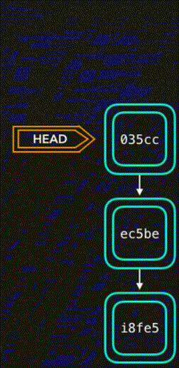
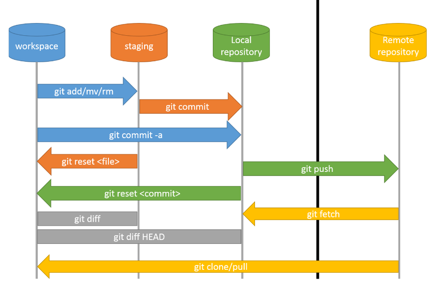
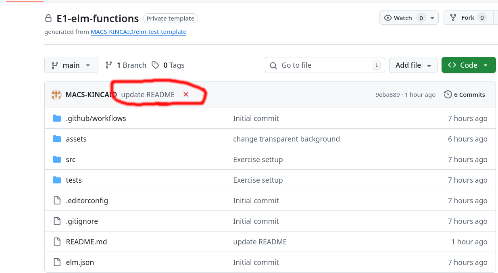
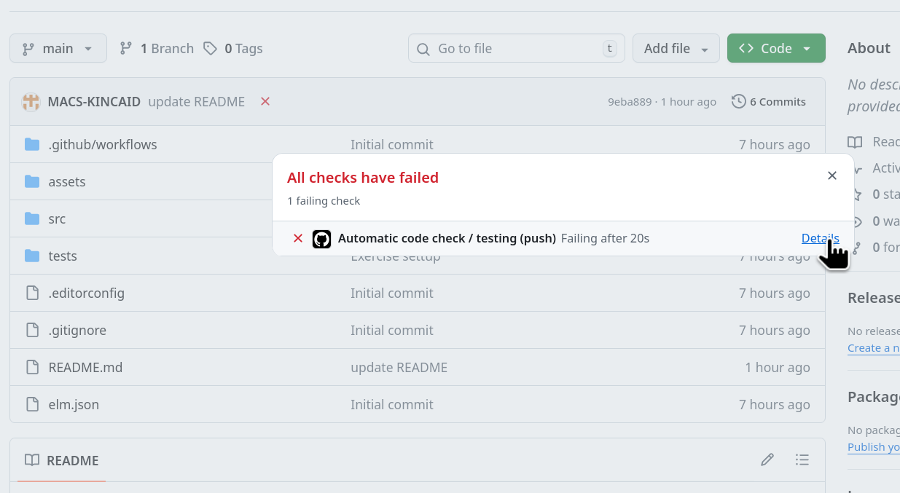
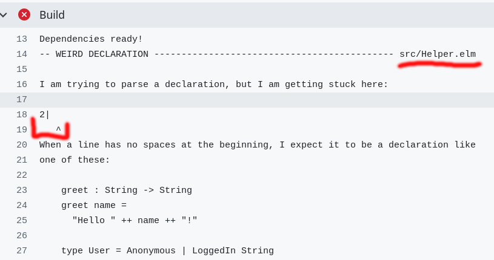

---
theme:
    override:
        code:
            theme_name: railsEnvy
        default:
            colors:
                background: "10141c"
---

<!-- column_layout: [1,2] -->
<!-- column: 0 -->
<!-- jump_to_middle -->
# **Git crash course**

Mitsiu Alejandro Carreño Sarabia
<!-- column: 1 -->


<!-- reset_layout -->
<!-- end_slide -->

Agenda
===

├── Installation    
├── Get help    
├── Git workflow     
├── Cheatsheet      
└── Remote     

<!-- end_slide -->
<!-- jump_to_middle -->
# Installation
<!--end_slide -->

# Installation
Install git from the following link, follow the steps depending on your OS.

[](https://git-scm.com/install/)

Verify the installation with:
```bash
git --version 
```
<!-- end_slide -->
<!-- jump_to_middle -->
## Get help
<!--end_slide -->

## Get help

This crash course will cover the most basic commands for submitting your exercises/homework.
If you only take a single concept out of this slides is to learn how to get help on any git command.    
<!-- new_line -->
The general formula for any git command is:
`git <command> <args>`      
any question you can do     
`git <command> --help` o go to [](https://git-scm.com/docs)
<!-- end_slide -->

## Get help
How did i learn the general formula?
```bash
$ git --help
usage: git [-v | --version] [-h | --help] [-C <path>] [-c <name>=<value>]
           [--exec-path[=<path>]] [--man-path] [--info-path]
           [--no-replace-objects] [--bare]
           [--git-dir=<path>] [--work-tree=<path>] [--namespace=<name>]
           <command> [<args>]
```

Where:
- [] = opcional argument or command 
- | = other name for a given argument or commando
- <> = placeholder

<!-- end_slide -->
## Understanding commands
```bash
$ git --help
usage: git [-v | --version] 
```

This two commands are equal
```bash +exec
git -v
git --version
```

<!-- end_slide -->
## Initial Setup
You must define your user and email with the following commands:
```bash
git config --global user.name "<Your username>"
git config --global user.email "<Your email@alumnos.upa.edu.mx>"
```
<!-- end_slide -->

<!-- jump_to_middle -->
### Git workflow

<!--end_slide -->
### Get your first repo
You can create a local copy of a remote repo with:
```bash
$ git clone <url>
```

This command will create a new folder in the current directory.
Enter the new folder with `cd`
<!-- end_slide -->

### Git status
You can know the state of your repo with:
```bash
$ git status
On branch main
Your branch is up to date with 'origin/main'.

nothing to commit, working tree clean
```

This output singals that no changes has been performed.

Let's modify src/Helper.elm and add "double x = 2 * x" at the bottom.
<!-- end_slide -->
### Check changes
```bash {all|1|2-8|2,4-5|8}
$ git diff
diff --git a/src/Helper.elm b/src/Helper.elm
index 55edd56..5a1070a 100644
--- a/src/Helper.elm
+++ b/src/Helper.elm
@@ -1 +1,2 @@
 module Helper exposing (..)
+double x = 2 * x
```
- Green lines starting with + are new lines
- Red lines starting with - are deleted lines
<!-- end_slide -->
### Git state (Read your outputs)

- **Working directory** => The stage to `create, modify or delete` files. Git won't tracked this changes.

```bash {all|1|3-10|4-5|6-7,10|all}
$ git status
On branch main
Changes not staged for commit:
  (use "git add <file>..." to update what will be committed)
  (use "git restore <file>..." to discard changes in working directory)
    modified:   src/Helper.elm

no changes added to commit (use "git add" and/or "git commit -a")
```

<!--end_slide -->


### From working dir to index/stage (Read your outputs)

- **Index/Staging** => At this stage git start to `track files and modifications locally` 

```bash {all|1|4-8|5,7-8|6|all}
$ git add src/Helper.elm

$ git status
On branch main
Changes to be committed:
  (use "git restore --staged <file>..." to unstage)
    modified:   src/Helper.elm
```

<!--end_slide -->

### From index/stage to HEAD (Read your outputs)


- **Commit** => Command to `capture the current state in (index/stage)`

We must provide a simple description of the work to commit.
```bash
$ git commit -m'Complete double function'
```

This command create a snapshot of the changes indexed/staged.    
All work in the working directory remains unchanged.

<!--end_slide -->
### Adding commits
- **Commit** => Command to `capture the current state in (index/stage)`
- **HEAD** => `Pointer` to the latest commit
<!-- column_layout: [1,1] -->
<!-- column: 0 -->

<!-- column: 1 -->

<!--end_slide -->

### From HEAD to remote 

- **Remote repo** When we are done with our local changes we can push them into out remote repo

```bash {all|1|9|all}
$ git push origin main
Enumerating objects: 7, done.
Counting objects: 100% (7/7), done.
Delta compression using up to 12 threads
Compressing objects: 100% (4/4), done.
Writing objects: 100% (5/5), 520 bytes | 520.00 KiB/s, done.
Total 5 (delta 0), reused 0 (delta 0), pack-reused 0 (from 0)
To github.com:MACS-KINCAID/E1-elm-functions.git
   ecf4186..dd574be  main -> main
```

<!--end_slide -->

#### Cheatsheet



<!--end_slide -->

#### 101 Git commands 
<!-- column_layout: [2,3] -->
<!-- column: 0 -->
```bash +line_numbers
# Clone remote repo
git clone <URL>

# Get current branch status
git status

# See changes in working directory
git diff
```
<!-- column: 1 -->
```bash +line_numbers
# Start tracking changes into files 
git add <file1> <file2>

# Create a snapshot with the content of stage
git commit -m'<Descrip de cambios>'

# Download remote changes 
git pull origin main

# Update remote changes with local changes
git push origin main
```

*origin => remote name

<!-- end_slide -->
<!-- jump_to_middle -->
##### Remote
<!--end_slide -->

##### CI tests 
On each push a set of test start to evaluate the quality of your code.     
For more details click on the ❌

<!-- end_slide -->
##### CI tests
Click on "details"

<!-- end_slide -->
##### Fail detail
My example is pretty basic, my file is mostly empty, that's the error:

<!-- end_slide -->

##### CI commands
These are the four commands that are evaluated, you can run them locally. To solve the errors faster.
- Validate format
```bash
elm-format src/ --validate
```
- Run checks
```bash
elm-review \
--template jfmengels/elm-review-common/example \
--rules NoMissingTypeAnnotation,NoMissingTypeAnnotationInLetIn
```
<!-- end_slide -->

##### CI commands
These are the four commands that are evaluated, you can run them locally. To solve the errors faster.
- Build
```bash
elm make src/*
```
- Run tests
```bash
elm-test
```

This is your first class exercise/homework.
