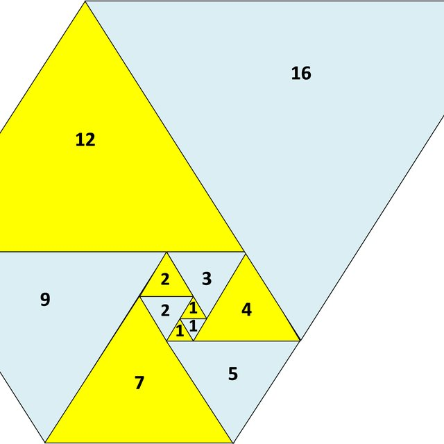
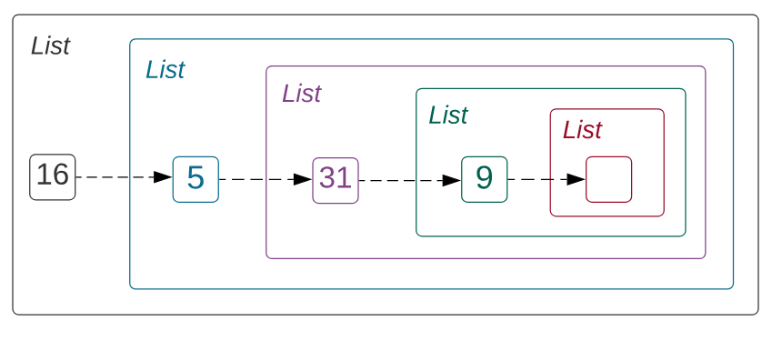
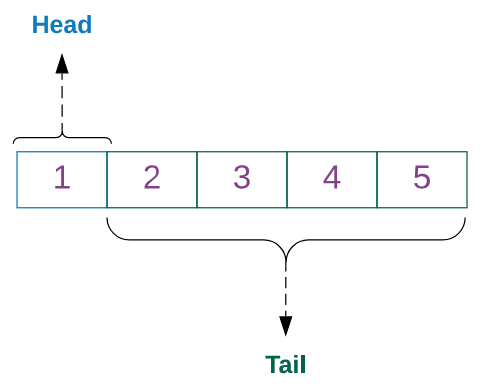

---
theme:
    override:
        code:
            theme_name: railsEnvy
        default:
            colors:
                background: "10141c"
---
<!-- column_layout: [1,2] -->
<!-- column: 0 -->
<!-- jump_to_middle -->
# Lists
Mitsiu Alejandro Carreño Sarabia
<!-- column: 1 -->
<!-- new_line -->
<!-- new_line -->


<!-- end_slide -->
Agenda
===
├── Recap   
├── Lists      
├── Loops      
└── Map

<!-- end_slide -->
<!-- jump_to_middle -->
# Recap
<!-- end_slide -->
# Code recap
<!-- column_layout: [1,1] -->
<!-- column: 0 -->
What can we infer from the following type annotation?
```elm
something : Bool -> String
```
<!-- pause -->
What does this function do?
```elm
getIdByName : String -> Int
getIdByName name =
    case name of
        "Fernanda" ->1
        "Miguel" ->2
        "Juan" ->3
        _ ->0
```
<!-- pause -->
<!-- column: 1 -->
```elm
getGradeById : Int -> Float
getGradeById id =
    case id of
        1 ->9.4
        2 ->8.7
        3 ->9.3
        _ ->0

```
<!-- pause -->
```elm
getFinalGrade : String -> Float
getFinalGrade name =
    getGradeById (getIdByName name)
```
<!-- end_slide -->
# Commands recap
<!-- column_layout: [1,1] -->
<!-- column: 0 -->
Create an elm project?
<!-- pause -->
- elm init     
<!-- new_line -->
Start an elm repl session?
<!-- pause -->
- elm repl     
<!-- new_line -->
Track changes in git?
<!-- pause -->
- git add \<file\>    
<!-- column: 1 -->
Commit changes in git?
<!-- pause -->
- git commit -m'description'      
<!-- new_line -->
Push to remote repo in git?
<!-- pause -->
- git push origin main      
<!-- new_line -->
Verify elm code compilation? 
<!-- pause -->
- elm make src/*       
<!-- reset_layout -->
<!-- end_slide -->

<!-- jump_to_middle -->
## Lists
<!-- end_slide -->
## Lists
To write more interesting functions, we have to introduce the primitive `List`

> For `any type alpha`, there's a type List alpha, which `describes an ordered collection of 0 or more elements of type alpha`

```latex +render
$\text{[ ] : List }\alpha $
```
<!-- column_layout: [2,5] -->
<!-- column: 0 -->
So we have:
- List Int
<!-- pause -->
- List String
<!-- pause -->
- List List Int
<!-- column: 1 -->
For example: 
- [1,2,3]
<!-- pause -->
- ["Fernanda", "Juan", "Luis"]
<!-- pause -->
- \[\[1,2,3\]\]
<!-- end_slide -->
## Lists
A list is `two possible variants` (two possible things):
<!-- pause -->
- Nil: [] an empty list of type alpha
<!-- pause -->
- Cons: (::) An operator such that:
<!-- column_layout: [1,1] -->
<!-- column: 0 -->
```latex +render
\begin{align}
x :: xs &: \text{List } \alpha \\
if \\
x &: \alpha \\
and \\
xs &: \text{List } \alpha
\end{align}
```
<!-- column: 1 -->
So we can say:
```elm
2 :: []  
```
Take take 2 and put it in this list as the first element
```latex +render +width:40%
$$ 2 :: [\text{ }] \cong [2]$$
```
<!-- end_slide -->
## Lists
In elm repl if we type (::) we get:
```elm
<function> : a -> List a -> List a
```
This is our first function with two parameters.
1. An element of type alpha
2. A list of type alpha
<!-- new_line -->
The output is of type List alpha (last arrow)
```elm
"Hi" :: [] : List String
```

<!-- end_slide -->
## Lists
<!--column_layout: [3,4] -->
<!-- column: 0 -->
When we write a list:

We are actually doing this:

Which will be right-associative:

<!-- column: 1 -->
```elm
[16, 5, 31, 9] : List Int
```
```elm
16 :: 5 :: 31 :: 9:: [] : List Int
```
```elm
16 :: (5 :: (31 :: (9 ::[]))) : List Int
```
<!-- reset_layout -->

<!-- end_slide -->
## Lists & Cases
We just saw how to construct Lists, now lets learn how to deconstruct them, with cases.     
<!-- column_layout: [2,3,2] -->
<!-- column: 0 -->
Remember that cases have the notation:
```latex +render
\begin{align}
\text{case } e1 &: \alpha \text{of} \\
pat1 &: \alpha \text{->} \\
& e2 : \beta
\\
pat2 &: \alpha \text{->} \\
& e3 : \beta
\end{align}
```
<!-- column: 1 -->
The pat stands for `pattern` which means we can `case on structures` rather than only on values:
```elm
case [1,2,3,4,5] of
    [] ->
        []
    x :: xs ->
        [x]
```
<!-- column: 2 -->

<!-- end_slide -->
## List
Let's make a quick function that uses the cons operator:
<!-- pause -->
```elm
headAdder : a -> List a -> List a
headAdder newElement list =
    newElement :: list

headAdder 1.1 [1.2, 1.3]
```
<!-- end_slide -->
## List exercises
1. Make a function "isEmpty" that returns if a given String List is empty or not (Bool).
2. Make a function "head" that returns the first Int in a Int list, if the list is empty return -100.

<!-- end_slide -->
<!-- column_layout: [1,3] -->
<!-- column: 0 -->
<!-- jump_to_middle -->
### Loop
<!-- column: 1 -->
<!-- new_line -->
<!-- new_line -->
<!-- new_line -->

<!-- end_slide -->
### Our old ways
Remember how in imperative contexts we have:
<!-- column_layout: [3,4] -->
<!-- column: 0 -->
```java +line_numbers
int x = 0;
for (int i = 0; i < 5; i++){
    x = x + 1;  
}
```
<!-- column: 1 -->
- We agreed that x = x + 1 on line 3 is `no bueno` because we modify the value
<!-- pause -->
- By the same principle i++ (i = i + 1) on line 2 must be gone
<!-- reset_layout -->
<!-- pause -->
- Actually the whole concept of a for loop or while loop needs to be gone, so how is this done in functional programming?

<!-- end_slide -->
### Length
Let's use our new knowledge on lists to calculate the length of a given list
What's our type annotation?
<!-- pause --> 
```elm
length : List Int -> Int
```
We mentioned our list can be either one of two things...
<!-- pause -->
```elm
length : List Int -> Int
length l =
    case l of
        [] ->
        x :: xs ->
```

<!-- end_slide -->
### Length
<!-- column_layout: [1,2] -->
<!-- column: 0 -->
Current progress:
```elm
length : List Int -> Int
length l =
    case l of
        [] ->
        x :: xs ->
```
<!-- column: 1 -->
- If our list is empty (nil) what's the length?
<!-- pause -->
```elm
length : List Int -> Int
length l =
    case l of
        [] -> 0
        x :: xs -> 
```

<!-- end_slide -->
### Length
<!-- column_layout: [1,2] -->
<!-- column: 0 -->
Current progress:
```elm
length : List Int -> Int
length l =
    case l of
        [] -> 0
        x :: xs -> 
```
<!-- column: 1 -->
- If our list is not empty (x::xs) what should we do? How does it affect our length calculation?
<!-- pause -->
```elm
length : List Int -> Int
length l =
    case l of
        [] -> 0
        x :: xs -> 1 + ??
```
At ?? do we care about x or xs?
<!-- pause -->
We dont care about x because we already encoded it's value as 1 + something
<!-- end_slide -->
### Length 
If we know that the list is not-empty, we add one and try to get the length of the rest of the list.
```elm
length : List Int -> Int
length l =
    case l of
        [] -> 0
        x :: xs -> 1 + length xs
```
<!-- end_slide -->
<!-- jump_to_middle -->
#### Map 
<!-- end_slide -->
#### Map 
Map is our first higher order function, it's one powerfull function that allows us to make a transformation to each element in our list.
Let's start by analizing it's type:
```elm
List.map
<function> : (a -> b) -> List a -> List b
```
<!-- column_layout: [1,1] -->
<!-- column: 0 -->
How many parameters does it have?
<!-- pause -->
- Anwser 2:
- 1. (a -> b) 
- 2. List a 
<!-- column: 1 -->
Which type is the output?
<!-- pause -->
- List b

What does the parameter `(a -> b)` mean?
<!-- end_slide -->
#### Map 
Let's review our understanding with `(a -> b)`:
If I say
```elm
mystery : a -> b
```
What does it mean?
<!-- pause -->
It means a function with input a (alpha) and output b (beta)
Previously we used both alpha and beta as placeholder for a lot of types lets consider:
<!-- column_layout: [1,1] -->
<!-- column: 0 -->
```elm
always2 : a -> Int
always2 x =
    2
```
<!-- column: 1 -->
How do we apply always2?
<!-- pause -->
```elm
always2 1
always2 "1"
always2 'a'
always2 False
```
<!-- end_slide -->
#### Map 
Let's track back into map.
```elm
List.map
<function> : (a -> b) -> List a -> List b
```
List.map is a function that receives a function and a list and returns other list.

This is a powerfull concept, functions are values, and as such we can pass them as parameters! 

This notion has been adopted by a lot of programming paradigms & languages because is quite usefull.
<!-- end_slide -->
#### Map 
<!-- column_layout: [2,3] -->
<!-- column: 0 -->
Let's make a simple function `a->b` with two different types.

```elm
cBool in =
    case in of
        0 -> 
            False
        _ -> 
            True
```
What's the type annotation of this function?
<!-- pause -->
```elm
cBool : Int -> Bool
```
<!-- column: 1 -->
Now we have a type for `a -> b` let's replace on List.map:
- a => Int 
- b => Bool
```elm
List.map
<function> : (a -> b) -> List a -> List b
```
<!-- pause -->
```elm
List.map
<function> : (Int -> Bool) -> List Int -> List Bool
```
Any idea on what List.map may do?
<!-- end_slide -->
#### Map
1. (a -> b) = Performs a transformation on input a's and produces b's
2. List a = The transformation will be applied to each element in a list
```elm
cBool : Int -> Bool
cBool inp =
    case inp of
        0 -> False
        _ -> True

listA : List Int
listA = [-2,-1,0,1,2]

List.map cBool listA -- => [True, True, False, True, True]
```
<!-- end_slide -->
#### Map Exercises
1. Create a function "canBuyAlcohol" that given an array of ages return True or False if is able to buy alcohol (>17)
2. Create a function "allUpperCase" that given an array of names return the same names in uppercase (String.toUpper) 
3. Create a function "approveCourse" that given an array of grades (Float) return if it approve or not the course (>6).
