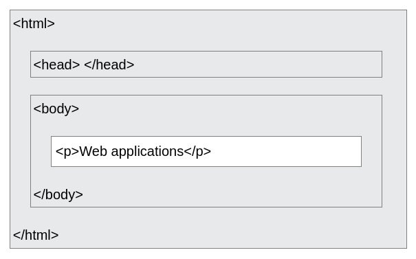

---
theme:
    override:
        code:
            theme_name: railsEnvy
        default:
            colors:
                background: "10141c"
---
<!-- column_layout: [1,2] -->
<!-- column: 0 -->
<!-- jump_to_middle -->
# Html
Mitsiu Alejandro Carreño Sarabia
<!-- column: 1 -->
<!-- new_line -->
<!-- new_line -->
<!-- new_line -->


<!-- end_slide -->
Agenda
===
├── Recap   
├── Html elements      
├── Attributes     
├── Elm    
├── elm reactor     
├── Challenge     
└── Elm

<!-- end_slide -->
<!-- jump_to_middle -->
# Recap
<!-- end_slide -->
# Code recap
<!-- column_layout: [1,1] -->
<!-- column: 0 -->
What can we infer from the following type annotation?
```elm
something : (Bool -> Int) -> Bool -> Int
```
<!-- pause -->
What does this function application produce?
```elm
double : Int -> Int
double x =
    2 * x

List.map double [1,2,3,4,5]
```
<!-- column: 1 -->
```elm
mystery : List Int -> Int -> Int
mystery l acc =
    case l of
        [] ->
            acc
        x :: xs ->
            mystery xs
                (if x > acc then
                    x
                 else
                    acc
                )
mystery [1,2,3,4,5,4,3,2,1] 0
```
What does this expression reduces to?
What does mystery calculate?

<!-- end_slide -->
# Commands recap
<!-- column_layout: [1,1] -->
<!-- column: 0 -->
Create an elm project?
<!-- pause -->
- elm init     
<!-- new_line -->
Track changes in git?
<!-- pause -->
- git add \<file\>    
<!-- column: 1 -->
Commit changes in git?
<!-- pause -->
- git commit -m'description'      
<!-- new_line -->
Push to remote repo in git?
<!-- pause -->
- git push origin main      
<!-- new_line -->
Enforce format rules on our code? 
<!-- pause -->
- elm-format src/        
<!-- reset_layout -->
<!-- end_slide -->
# Tokens recap
<!-- column_layout: [2,3] -->
<!-- column: 0 -->
Mit-managed

<!-- pause -->
<!-- column: 1 -->
Self-managed

<!-- end_slide -->
<!-- jump_to_middle -->
## Html
<!-- end_slide -->
## Html
> HTML (HyperText Markup Language) is a markup language that tells web browsers how to structure the web pages you visit.

HTML lives inside text files called HTML documents, or just documents, with a **.html** file extension. An HTML document contains the web page's `content` and specifies its `structure`.

<!-- end_slide -->
## Html elements
HTML consists of a series of elements:

<!-- pause -->
- Openning tag -> Name of the element (eg p for paragraph) in angle brackets, marks the element starts.
<!-- pause -->
- Content
<!-- pause -->
- Closing tag -> Slash & name of the element, marks the element end.
<!-- end_slide -->

## Html demo
1. Create a folder "Ex2-html"
2. Inside "Ex2-html" create a file named `main.html`
3. Inside write "\<p\>Web applications\</p\>" and save changes
4. Open the file in your browser.
<!-- pause -->
5. Right click on the page and choose "Inspect" or "Inspect element"
6. In the new sub-window, select "Elements" or "Inspector"

How many html element's are on our page?
<!-- pause -->
Is there any hierarchical relationship between this elements?
> Elements can be placed within other elements. This is called nesting.
<!-- end_slide -->

## Html demo
<!-- column_layout: [1,1] -->
<!-- column: 0 -->

<!-- column: 1 -->
Let's update our main.html
```html
<!DOCTYPE html>
<html>
    <head></head>
    <body>
        <p>Web application</p>
    </body>
</html>
```
<!-- reset_layout -->
1. Notice the "\<!DOCTYPE html>" at the first line, it defines that this document is an html5 document.
2. It's easier writting both opening and closing tags first
3. It's easier aligning opening and close tags identation
<!-- end_slide -->

## Html elements
- \<p> -> Paragraph
- \<h1> -> Header 1
- \<strong> -> Bold text
- \<div> -> Divider (Structural)
We can place several elements inside a container (div)

Let's update our file with:
```html
<div>
    <h1>This is an header 1</h1>
    <p>This is a paragraph with a <strong>strong</strong> word</p>
</div>
```
<!-- end_slide -->

## Void elements
> Not all elements follow the pattern of an opening tag, content, and a closing tag. 
Some elements consist of a single tag, which is typically used to insert/embed something in the document. 

Such elements are called void elements.

- \<br> -> Jump to a new line
```html
<p>Hello<br>World</p>
```
<!-- end_slide -->
<!-- jump_to_middle -->
### Html attributes
<!-- end_slide -->
### Html attributes
Elements can also have attributes.
> Attributes contain extra information about the element that won't appear in the content.


- A space between the attribute and the element name
- The attribute name followed by an equal sign.
- An attribute value, wrapped with opening and closing quotes
- Attributes are always specified in the start tag
- Attributes usually come in name/value pairs like: name="value"
<!-- end_slide -->
### Attributes demo
Let's add the attribute class into any of our html elements and see what happens on the browser.
<!-- end_slide -->

### Elements and attributes
Let's disect the following html code:
```html
<a href="https://upa.edu.mx">My school</a>
```
<!-- column_layout: [1,1] -->
<!-- column: 0 -->
- What's the element name?
<!-- pause -->
- - a
<!-- new_line -->
- Does it has attributes?
<!-- pause -->
- - Yes
<!-- column: 1 -->
- What is the element content?
<!-- pause -->
- - My school
<!-- new_line -->
- Is it avoid element?     
<!-- pause -->
- - No (it has closing tag)
<!-- reset_layout -->
- What are the attribute key and value?
<!-- pause -->
- - key = href       
- - Value = https://upa.edu.mx 
<!-- end_slide -->
<!-- jump_to_middle -->
#### Elm
<!-- end_slide -->
#### Elm
1. Let's create a new elm project in our "Ex2-html" folder (`elm init`)
2. Create a file "Main.elm"
```elm
module Main exposing (main)

import Html
import Html.Attributes

main : Html.Html msg
main =
    
```
<!-- end_slide -->
#### Elm html
In elm we can focus only on the content: 
<!-- column_layout: [1,1] -->
<!-- column: 0 -->
```html
<!DOCTYPE html>
<html>
    <head></head>
    <body>
        <p>Web application</p>
    </body>
</html>
```
<!-- column: 1 -->

```elm
module Main exposing (main)

import Html
import Html.Attributes

main : Html.Html msg
main =
    Html.p 
```
<!-- reset_layout -->
```elm
Html.p : List (Html.Attribute msg) -> List (Html.Html msg) -> Html.Html msg
```
<!-- end_slide -->

#### Elm html
```elm
Html.p : List (Html.Attribute msg) -> List (Html.Html msg) -> Html.Html msg
```
<!-- column_layout: [1,1] -->
<!-- column: 0 -->
```html
<!DOCTYPE html>
<html>
    <head></head>
    <body>
        <p>Web application</p>
    </body>
</html>
```
Do we have any attribute?
<!-- pause -->
<!-- column: 1 -->
```elm
module Main exposing (main)

import Html
import Html.Attributes

main : Html.Html msg
main =
    Html.p 
        []
```
<!-- reset_layout -->
<!-- end_slide -->
#### Elm html
```elm
Html.p : List (Html.Attribute msg) -> List (Html.Html msg) -> Html.Html msg
---
Html.text : String -> Html.Html msg
```
<!-- pause -->
<!-- column_layout: [1,1] -->
<!-- column: 0 -->
```html
<!DOCTYPE html>
<html>
    <head></head>
    <body>
        <p>Web application</p>
    </body>
</html>
```
<!-- pause -->
<!-- column: 1 -->
```elm
main : Html.Html msg
main =
    Html.p 
        []
        [ Html.text "Web applications"]
```
<!-- reset_layout -->
<!-- end_slide -->
#### Elm html
Final complete code:
<!-- column_layout: [1,1] -->
<!-- column: 0 -->
```html
<!DOCTYPE html>
<html>
    <head></head>
    <body>
        <p>Web application</p>
    </body>
</html>
```
<!-- column: 1 -->

```elm
module Main exposing (main)

import Html
import Html.Attributes

main : Html.Html msg
main =
    Html.p 
        []
        [ Html.text "Web applications" ]
```
<!-- reset_layout -->
<!-- end_slide -->

<!-- jump_to_middle -->
##### elm reactor
<!-- end_slide -->

##### elm reactor
Once our code is complete we can test it the regular way with:
```bash
elm repl
import Main
```
We should get no errors! 
Then we can proceed with:
```bash
elm reactor
```
And open a browser tab at `localhost:8000`     
Navigate the file explorer to src/Main.elm
<!-- end_slide -->

<!-- jump_to_middle -->
###### Challenge
<!-- end_slide -->
###### Challenge
Are you able to produce the following html code in elm?
```elm
<div>
    <h1>Nested h1</h1>
</div>
```
