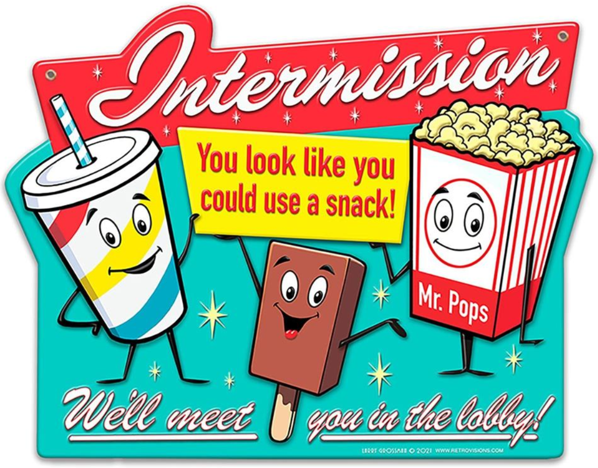

---
theme:
    override:
        code:
            theme_name: railsEnvy
        default:
            colors:
                background: "10141c"
---
<!-- column_layout: [1,2] -->
<!-- column: 0 -->
<!-- jump_to_middle -->
# Intermission
Mitsiu Alejandro Carreño Sarabia
<!-- column: 1 -->
<!-- new_line -->
<!-- new_line -->
<!-- new_line -->

<!-- end_slide -->
Agenda
===
├── Richard Feyman    
└── Recaps 

<!-- end_slide -->
# Richar Feyman
THE PROBLEM OF TEACHING PHYSICS IN LATIN AMERICA

https://calteches.library.caltech.edu/46/2/LatinAmerica.htm

> First, and most serious, I believe, is the almost exclusive teaching and learning by `means of pure abject memory`.  This in no way teaches physics as a science.  `Nothing is understood; it is only remembered.`  This in no way satisfies the reasons I outlined for teaching science.  `Memorization of laws does not permit one to make applications of these laws to new situations`; it does not permit one the pleasure of ultimately making scientific contributions; it cannot teach any techniques with the hands.  From memorizing, knowledge is not understood, and the beauty of nature is not appreciated.  It does not tell how things were found out, or reveal `the value of an inventive free mind`.

<!-- end_slide -->
> They cannot converse with other students; they cannot see how stupid some fellow students are.  This is mainly for some psychological reason.  They `do not wish to be found unsure, for they will be ridiculed`.  They cannot ask questions in class because the others later say, "Why do you waste the time of all of us?  Everyone knows that."  So, to save face, they all put on a show of knowledge, `thereby frustrating free discussion and the exchange of ideas` – one of the pleasantest and easiest ways of learning things.  There is too much show, and too much formality in the classroom for any exercise of free thought and discussion.

> A third problem is the `lack of freedom in the university structure.`  You cannot move around from one subject to another or from one lab to another.  
<!-- end_slide -->
> Finally, in learning science you `learn to handle trial and error`, to develop a spirit of invention and of free inquiry which is of tremendous value far beyond science.

<!-- end_slide --> 
<!-- jump_to_middle -->
## Recaps

