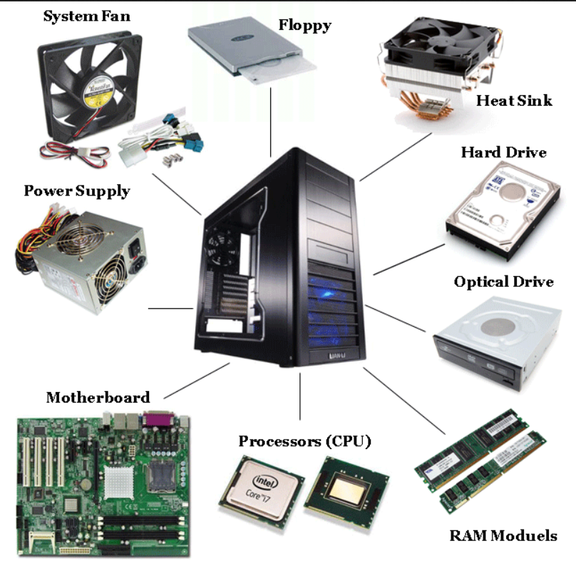

---
theme:
    override:
        code:
            theme_name: railsEnvy
        default:
            colors:
                background: "10141c"
---
<!-- column_layout: [1,1] -->
<!-- column: 0 -->
<!-- jump_to_middle -->
# Components
Mitsiu Alejandro Carreño Sarabia
<!-- column: 1 -->
<!-- new_line -->
<!-- new_line -->
<!-- new_line -->


<!-- end_slide -->
Agenda
===
├── Recap   
├── Components     
└── Union types 

<!-- end_slide -->
<!-- jump_to_middle -->
# Recap
<!-- end_slide -->
# Html recap
Can you help me describe the following html elements?
- \<div>\</div>
<!-- pause -->
It's a content `div`ision element, allows us to contain and group other elements and structure our page.
- \<h1>\</h1> | \<h2>\</h2> | \<h3>\</h3>
<!-- pause -->
Are several `h`eaders, to display, titles, subtitles, subsubtitles...
- \<p>\</p>   
<!-- pause -->
It's the `p`aragraph element, allows us to display text blocks
<!-- end_slide -->
# Html recap
Can you help me describe the following html elements?
- \<a>\</a>
<!-- pause -->
The `a`nchor element, allows to hiperlink pages, emails, locations via URL's
- \<ul> \<li>\</li> \</ul>
<!-- pause -->
The parent element is for `u`nordered `l`ists (ul), to display categorical information, (all elements are equally different).      
Inside we find `l`ist `i`tems (li), representing each possible category.
- \<br>
<!-- pause -->
Marks a point in html to produce a line `br`eak
<!-- end_slide -->
# Previously on...
<!-- column_layout: [1,2] -->
<!-- column: 0 -->
Let's define a record named "Computer" with:
- ram: String
- model: String
- brand: String
- screenSize: String

And create a variable "myLaptop" of type Computer
<!-- column: 1 -->
Finally, let's make a variable "main" that reduces to:
```html
<div>
  <h1>My laptop<h1>
  <div>
    <ul>
      <li>Ram: {{.ram myLaptop}}</li>
      <li>Modelo: {{.model myLaptop}}</li>
      <li>Marca: {{.brand myLaptop}}</li>
      <li>Pulgadas: {{.screenSize myLaptop}}</li>
    </ul>
  </div>
</div>
```
<!-- end_slide -->
# Previously on...
<!-- column_layout: [1,2] -->
<!-- column: 0 -->
Let's define a record named "Computer" with:
- ram: String
- model: String
- brand: String
- screenSize: String

And create a variable "myLaptop" of type Computer
<!-- pause -->
<!-- column: 1 -->
```elm
type alias Computer =
    { ram : String
    , model : String
    , brand : String
    , screenSize : String
    }
```
<!-- pause -->
```elm
myLaptop : Computer
myLaptop =
    { ram = "32"
    , model = "Thinkpad x1"
    , brand = "Lenovo"
    , screenSize = "13.5"
    }
```
<!-- reset_layout -->
<!-- end_slide -->
# Previously on...
<!-- column_layout: [1,2] -->
<!-- column: 0 -->
Finally, let's make a variable "main" that reduces to:     
div     
├── h1     
└── div    
&nbsp;&nbsp;&nbsp;&nbsp;└── ul    
&nbsp;&nbsp;&nbsp;&nbsp;&nbsp;&nbsp;&nbsp;&nbsp;├── li    
&nbsp;&nbsp;&nbsp;&nbsp;&nbsp;&nbsp;&nbsp;&nbsp;├── li    
&nbsp;&nbsp;&nbsp;&nbsp;&nbsp;&nbsp;&nbsp;&nbsp;├── li    
&nbsp;&nbsp;&nbsp;&nbsp;&nbsp;&nbsp;&nbsp;&nbsp;└── li    
<!-- column: 1 -->
```html
<div>
  <h1>My laptop<h1>
  <div>
    <ul>
      <li>Ram: {{.ram myLaptop}}</li>
      <li>Modelo: {{.model myLaptop}}</li>
      <li>Marca: {{.brand myLaptop}}</li>
      <li>Pulgadas: {{.screenSize myLaptop}}</li>
    </ul>
  </div>
</div>
```
<!-- end_slide -->
# Previously on...
<!-- column_layout: [2,4] -->
<!-- column: 0 -->
Finally, let's make a variable "main" that reduces to:     
div     
├── h1     
└── div    
&nbsp;&nbsp;&nbsp;&nbsp;└── ul    
&nbsp;&nbsp;&nbsp;&nbsp;&nbsp;&nbsp;&nbsp;&nbsp;├── li    
&nbsp;&nbsp;&nbsp;&nbsp;&nbsp;&nbsp;&nbsp;&nbsp;├── li    
&nbsp;&nbsp;&nbsp;&nbsp;&nbsp;&nbsp;&nbsp;&nbsp;├── li    
&nbsp;&nbsp;&nbsp;&nbsp;&nbsp;&nbsp;&nbsp;&nbsp;└── li    
<!-- column: 1 -->
```elm
main : Html.Html msg
main =
    Html.div
        []
        [ Html.h1 [] [ Html.text "My laptop" ]
        , Html.div
            []
            [ Html.ul
                []
                [ Html.li
                    []
                    [ Html.text "Some info" ]
                ]
            ]
        ]
```
<!-- end_slide -->
<!-- jump_to_middle -->
## Components
<!-- pause -->
> A part that combines with other parts to form something bigger
-> https://dictionary.cambridge.org
<!-- end_slide -->
## Components 
> A React component is a JavaScript `function` that you can sprinkle with `markup`.
-> https://react.dev/learn/your-first-component

(Hyper Text Markup Language)
<!-- pause -->
<!-- new_line -->
<!-- new_line -->
`Components = Html + Functions`
<!-- new_line -->
Let's build our first component
<!-- end_slide -->
## Components = Html + Functions
Let's focus on a specific Html section:
<!-- column_layout: [2,3] -->
<!-- column: 0 -->
```html
<ul>
  <li>Some content</li>
</ul>
```
We are going to begin really simple
<!-- column: 1 -->
```elm
aList : Html.Html msg
aList = 
    Html.ul 
        [] 
        [ Html.li 
            []
            [ Html.text "Some content"]
        ]
```
<!-- end_slide -->
## Components = Html + Functions
Let's start by making the content more flexible i want to change the string literal "Some content" to be a parameter
<!-- column_layout: [1,1] -->
<!-- column: 0 -->
```elm
aList : Html.Html msg
aList = 
    Html.ul 
        [] 
        [ Html.li 
            []
            [ Html.text "Some content"]
        ]
```
<!-- column: 1 -->
<!-- pause -->
```elm
aList : String ->Html.Html msg
```
<!-- pause -->
```elm
aList content = 
    Html.ul 
        [] 
        [ Html.li 
            []
            [ Html.text content ]
        ]
```

<!-- end_slide -->
<!-- column_layout: [5,4] -->
<!-- column: 0 -->

It sucks to write this! 
<!-- pause -->
- It's redundant
- I can make typos
- I can copy/paste but what if we want to change something? (I would have to do it three times!)
<!-- column: 1 -->
```elm
aList : Html.Html msg
aList = 
    Html.ul 
        [] 
        [ Html.li [][]
        , Html.li [][]
        , Html.li [][]
        ]
```
