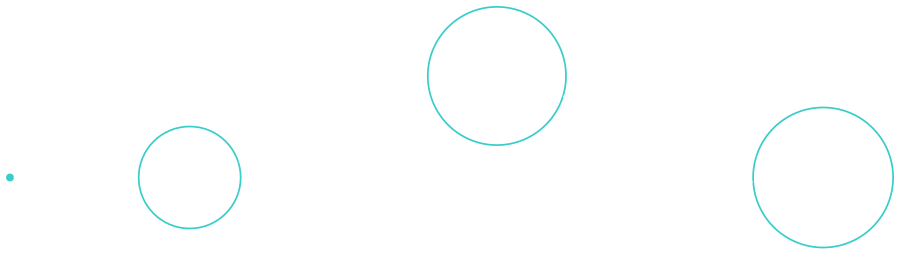
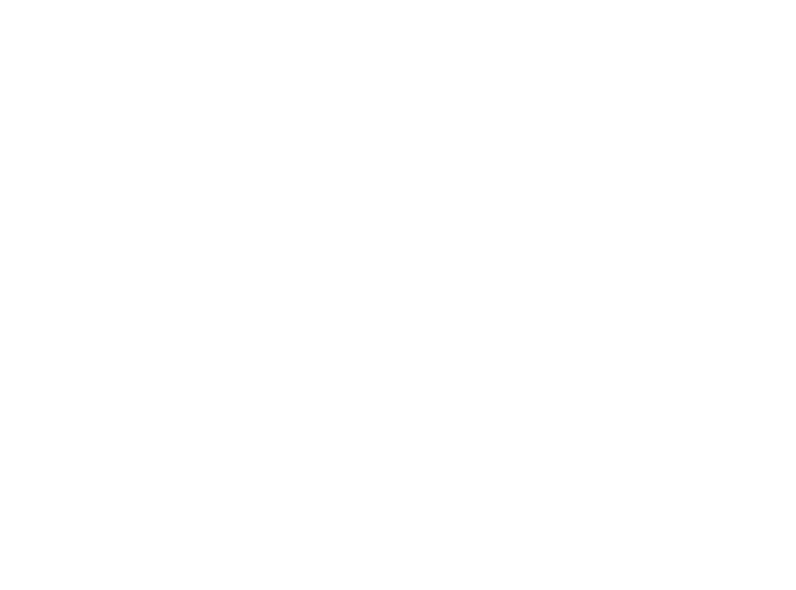

---
theme:
    override:
        code:
            theme_name: railsEnvy
        default:
            colors:
                background: "10141c"
---
<!-- column_layout: [1,1] -->
<!-- column: 0 -->
<!-- jump_to_middle -->
# More types
Mitsiu Alejandro Carreño Sarabia
<!-- column: 1 -->
<!-- jump_to_middle -->


<!-- end_slide -->
Agenda
===
├── Recap   
├── Types     
├── Types & Values      
└── Custom types    

<!-- end_slide -->
<!-- jump_to_middle -->
# Recap
<!-- end_slide -->
# Recap
Ok on our last lecture we learn that:
<!-- column_layout: [1,1] -->
<!-- column: 0 -->

```elm
anItem : Html.Html msg
```
In this case anItem is a variable of type Html.Html msg
<!-- column: 1 -->
```elm
anItem : String -> Html.Html msg
```
In this case anItem is a function that receives a String and returns an Html.Html msg
<!-- reset_layout -->
<!-- pause -->
<!-- column_layout: [1,1] -->
<!-- column: 0 -->
```elm
anItem = Html.li [] 
        [ Html.text "Static" ]
```
<!-- column: 1 -->
```elm
anItem str = Html.li []
        [ Html.text str ]
```
<!-- reset_layout -->
<!-- end_slide-->
# Recap
We also learned that List.map is pretty powerfull
```elm
List.map (a -> b) -> List a -> List b
```
If we replace
- a => String
- b => Html.Html msg    

```elm
List.map (String -> Html.Html msg) -> List String -> List (Html.Html msg)
```
<!-- end_slide -->
# Recap
```elm
List.map (String -> Html.Html msg) -> List String -> List (Html.Html msg)
```

We can turn a String into an Html (1st parameter) with:
```elm
anItem : String -> Html.Html msg
anItem str = Html.li []
        [ Html.text str ]
```

So given an arbitrary list of strings we can:
```elm
                                [ Html.li [] [ Html.text "1" ]
List.map anItem ["1", "2"]   => , Html.li [] [ Html.text "2" ]
                                ]
```
<!-- end_slide -->
# Recap
```elm
Html.ul []                      Html.ul [] 
                                  [ Html.li [] [ Html.text "1" ]
List.map anItem ["1", "2"]   =>   , Html.li [] [ Html.text "2" ]
                                  ]
```

We can use the List.map result => `List (Html.Html msg)` as the second parameter of any Html element
<!-- end_slide -->
# Recap
Before I forget, I want to introduce a brand new tool:

<!-- end_slide -->
# Recap
Maybe you notice but I have a horrible memory, I forget to give tokens, I forget names, I forget which lecture we are at.

But I really want to encourage you to ask questions, so:
<!-- pause -->
<!-- column_layout: [1,1] -->
<!-- column: 0 -->
I am offering two free tokens:
- To the person that remind's me to setup askqueue and share the link
<!-- pause -->
- To the person that remind's me to check askqueue if an hour has passed and I havent checked
<!-- column: 1 -->

<!-- end_slide -->
# Recap
Learning material:
1. This slides
2. https://www.youtube.com/watch?v=WgJ2FUW1miA&list=PLuGpJqnV9DXq_ItwwUoJOGk_uCr72Yvzb
3. https://elmprogramming.com/
4. (Official guide) https://guide.elm-lang.org/
5. (Official docs) https://package.elm-lang.org/packages/elm/core/latest/
6. (Advanced level - Standard ML) https://www.youtube.com/watch?v=jjX68oHAw-Y&list=PLsydD1kw8jng2t2G8USQNLz0faYZetPnH
<!-- end_slide -->
<!-- jump_to_middle -->
## Types
<!-- end_slide -->
## Types
Let's say we want to track if a student approved or failed the course, which data type should we use?
<!-- pause -->
Did I guess your solution?
```elm
approved : Bool
```
There's a little issue with using Bool, it's more limited than what we need.
Right now did you pass this course? Should I register False?
```elm
approved : Bool
approved = False
```
That doesn't represent reallity, you haven't approved the course, yet you haven't failed the course either!
<!-- end_slide -->
## Types
The current state about your grade is "pending" but a Bool only allows us two possible states.     
<!-- column_layout: [1,1] -->
<!-- column: 0 -->
Which data type should we use? 
<!-- pause -->
```elm
result : String
result = "Failed"

extraExam : String -> Bool
extraExam result = 
    case result of
        "approved" -> False
        "failed" -> True
        "pending" -> False
        _ -> False
```
<!-- pause -->
<!-- column: 1 -->
This solution has two big disadvantages:
1. We have to case on _ because there are many `other possible strings` even if they are not real result values
2. This code outputs that `no one should pay!
<!-- pause -->
("Failed" != "failed")
<!-- end_slide -->
<!-- jump_to_middle -->
### Types & values
<!-- end_slide -->
### Types & values
<!-- column_layout: [1,1] -->
<!-- column: 0 -->

<!-- column: 1 -->
Which values does a trafic light might have?
<!-- pause -->
- Green
- Yellow
- Red
<!-- reset_layout -->
<!-- column_layout: [1,1] -->
<!-- column: 0 -->

<!-- column: 1 -->
Even though 
- There are more colors (Purple, Brown, Blue)
- There are more strings ("Apple", "Car", "Traffic")
<!-- end_slide -->
### Types & values
<!-- column_layout: [1,1] -->
<!-- column: 0 -->

<!-- column: 1 -->
Which values does a trafic light might have?
<!-- pause -->
```elm
type TrafficLight
    = Green
    | Yellow
    | Red
```
<!-- reset_layout -->
<!-- column_layout: [1,1] -->
<!-- column: 0 -->

<!-- column: 1 -->
Even though 
- There are more colors (Purple, Brown, Blue)
- There are more strings ("Apple", "Car", "Traffic")
<!-- end_slide -->
### Types & values
> Types: Is a collection or grouping of data values, usually specified by a `set of possible values`, a set of allowed operations on these values, and/or a representation of these values as machine types.

<!-- column_layout: [1,1] -->
<!-- column: 0 -->
A `Bool` (other type) can have the values:
- True
- False

<!-- column: 1 -->
A `traffic light` (our type) can have the values: 
- Red 
- Green
- Yellow

We can express this in elm with:
```elm
type TrafficLight
    = Green
    | Yellow
    | Red
```
<!-- reset_layout -->
<!-- end_slide -->
### Types & values
<!-- column_layout: [1,1] -->
<!-- column: 0 -->
A `Bool` can have the values: 
- True
- False
<!-- column: 1 -->
```elm
type TrafficLight
    = Green
    | Yellow
    | Red
```
<!-- pause -->
<!-- column_layout: [1,1] -->
<!-- column: 0 -->
We can create a `myBool` of type `Bool` and bind the value `True`, because True is a possible value of type Bool
```elm
myBool : Bool
myBool = True
```
<!-- pause -->
<!-- column: 1 -->
We can create a `myTrafficLight` of type `TrafficLight` and bind the value `Green`, because Green is a possible value of type TrafficLight
```elm
myTrafficLight : TrafficLight
myTrafficLight = Green
```
<!-- reset_layout -->
<!-- end_slide -->
#### Custom types
Let's come back to our initial problem, we want to track if a student approved or failed the course or if the grade is still "Pending", Bool is to constrained, String is to loose, let's make a new type (collection of values) that fit this specific problem
Let's make our own data type:
<!-- column_layout: [1,1] -->
<!-- column: 0 -->
```elm
type GradeStatus 
    = Approved
    | Failed
    | Pending
```
We created a new data type (just like Int, Float, Bool) that have three possible values!
<!-- pause -->
<!-- column: 1 -->
We can create a variable of type GradeStatus
```elm
result: GradeStatus
result = Pending

falso : Bool
falso = False
```
<!-- end_slide -->
#### Custom types
Let's make our own data type:
<!-- column_layout: [1,1] -->
<!-- column: 0 -->
```elm
type GradeStatus 
    = Approved
    | Failed
    | Pending

result : GradeStatus
result = Pending
```
<!-- column: 1 -->
```elm
extraExam : GradeStatus -> Bool
extraExam result = 
    case result of
        Approved -> False
        Failed -> True
        Pending -> False
```
<!-- reset_layout -->
Approved is a posible value of the data type GradeStatus.    
Just like True is a possible value of the data type Bool.
<!-- end_slide -->

#### Custom types exercises
1.0 Create a function "categoricalGrade" that given a list of grades (float) return a list of (type) "GradeStatus" (with one of the following values) (Approved | Failed | Pending) where any negative number is Pending    
<!-- column_layout: [3,2] -->
<!-- column: 0 -->
2.1 Create a type "AirplaneStatus" (OnTime | Boarding | Delayed | Cancelled)

2.2 Create a function "airplaneScheduleAction" that maps as the following graph:     

2.3 Create a function "airportAction" that given a list of AirplaneStatus transform it into a list of strings with airplaneScheduleActions
<!-- column: 1 -->

