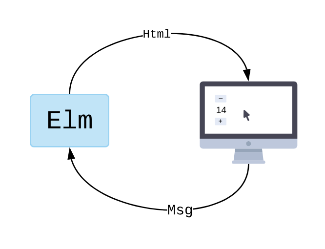
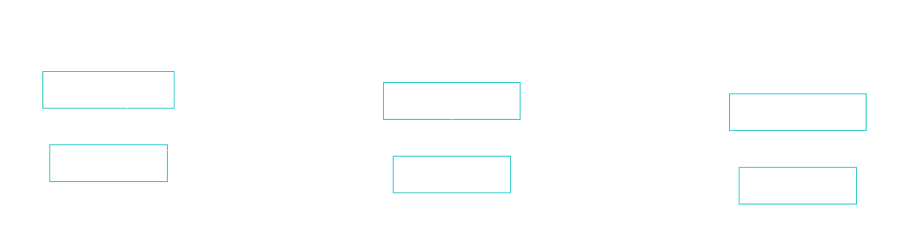
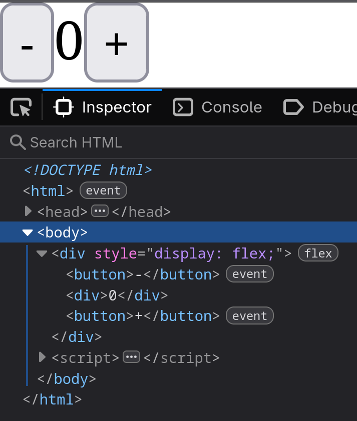
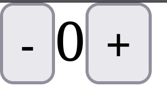
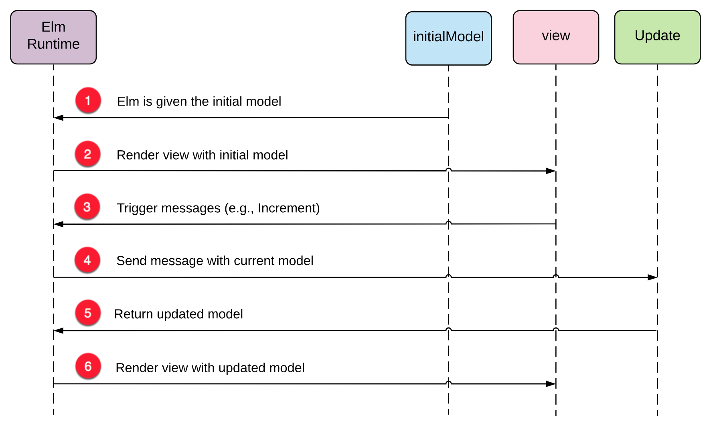

---
theme:
    override:
        code:
            theme_name: railsEnvy
        default:
            colors:
                background: "10141c"
---
<!-- column_layout: [1,1] -->
<!-- column: 0 -->
<!-- jump_to_middle -->
# Interaction
Mitsiu Alejandro Carreño Sarabia
<!-- column: 1 -->
<!-- new_line -->
<!-- new_line -->
<!-- new_line -->
<!-- new_line -->
<!-- new_line -->
<!-- new_line -->
<!-- new_line -->


<!-- end_slide -->
Agenda
===
├── Recap   
├── Elm arquitecture       
├── Model (State)       
├── View              
├── Update             
│   └── Msg             
├── View onClick             
├── Wiring everything up             
└── Homework    

<!-- end_slide -->

# Recap
Before I forget 

<!-- end_slide -->
# Recap
Our next tests:
- 2nd Partial = 30%
- - Class exercise / Homework = 10%
- - Theorical evaluation = 40%
- - Practical evaluation (paper based, NO computer!) = 50%

<!-- end_slide -->
<!-- jump_to_middle -->
## Elm arquitecture
<!-- end_slide -->
## Elm arquitecture
The basic pattern looks something like this:

The Elm program produces HTML to show on screen, and then the computer sends back messages of what is going on. "They clicked a button!"
<!-- end_slide -->
## Elm arquitecture
The basic pattern looks something like this:

What happens within the Elm program though? It always breaks into three parts:

- Model — the state of your application
- View — a way to turn your state into HTML
- Update — a way to update your state based on messages

<!-- end_slide -->
<!-- jump_to_middle -->
### Model (State)       
<!-- end_slide -->
### Model (State) - the state of your application       
Our application is really simple we want to keep track of a single Integer in a property currentNum inside a record:
```elm
type alias Model =
    { currentNum : Int }


init : Model
init =
    { currentNum = 0 }
```

During the whiteboard explanation I named it as model, but it's clearer to name it init, because it's our initial state
<!-- end_slide -->

<!-- jump_to_middle -->
### View       
<!-- end_slide -->
### View - A way to turn your state into HTML   
<!-- column_layout: [1,1] -->
<!-- column: 0 -->

<!-- column: 1 -->
```elm
view : Html.Html Msg
view =
    Html.div
        [ Html.Attributes.style "display" "flex" ]
        [ Html.button
            [ ]
            [ Html.text "-" ]
        , Html.div
            []
            [ Html.text "0" ]
        , Html.button
            [ ]
            [ Html.text "+" ]
        ]

```
<!-- end_slide -->
### View - A way to turn your state into HTML   
We can turn our variable into a function based on our current state:
<!-- column_layout: [1,1] -->
<!-- column: 0 -->
```elm
view : Html.Html Msg
view =
    ...
            [ Html.text "0" ]
```
<!-- column: 1 -->
```elm
view : Model -> Html.Html Msg
view model = 
    ...
            [ Html.text (String.fromInt (.currentNum model)) ]
```

<!-- end_slide -->
### View - A way to turn your state into HTML   
Here's the complete view function
```elm
view : Model -> Html.Html Msg
view model =
    Html.div
        [ Html.Attributes.style "display" "flex" ]
        [ Html.button [ ] [ Html.text "-" ]
        , Html.div
            []
            [ Html.text (String.fromInt (.currentNum model)) ]
        , Html.button [ ] [ Html.text "+" ]
        ]
```
<!-- end_slide -->
<!-- jump_to_middle -->
#### Update 
<!-- end_slide -->
#### Update - A way to update your state based on messages
Our update function will take our current model and produce the next version of our model, but it also need's to know what interaction happened.
```elm
update : _____ -> Model -> Model
update ___ model =
    case ___ of
        Increment ->
            { model | currentNum = .currentNum model + 1 }

        Decrement ->
            { model | currentNum = .currentNum model - 1 }
```
<!-- end_slide -->
#### Update - A way to update your state based on messages
# Msg - Interactions
In elm we name our interactions as Msg (messages)      
<!-- column_layout: [3,1] -->
<!-- column: 0 -->
Our application has two possible interactions:
- Increment (click the + button)
- Decrement (click the - button)
<!-- column: 1 -->

<!-- reset_layout -->
So we build a custom type that exactly fit's our application:
```elm
type Msg
    = Increment
    | Decrement
```
<!-- end_slide -->
#### Update - A way to update your state based on messages

```elm
type Msg
    = Increment
    | Decrement

update : Msg -> Model -> Model
update msg model =
    case msg of
        Increment ->
            { model | currentNum = .currentNum model + 1 }
        Decrement ->
            { model | currentNum = .currentNum model - 1 }
```
<!-- end_slide -->
<!-- jump_to_middle -->
##### View onClick
<!-- end_slide -->
##### View onClick
Let's revisit our view function:
```elm
view : Model -> Html.Html Msg
view model =
    Html.div
        [ Html.Attributes.style "display" "flex" ]
        [ Html.button [ ] [ Html.text "-" ]
        , Html.div
            []
            [ Html.text (String.fromInt (.currentNum model)) ]
        , Html.button [ ] [ Html.text "+" ]
        ]
```
<!-- end_slide -->
##### View onClick
It has a way to translate our state into HTML but it cannot send interactivity Messages
```elm +line_numbers {5,9}
view : Model -> Html.Html Msg
view model =
    Html.div
        [ Html.Attributes.style "display" "flex" ]
        [ Html.button [ ] [ Html.text "-" ]
        , Html.div
            []
            [ Html.text (String.fromInt (.currentNum model)) ]
        , Html.button [ ] [ Html.text "+" ]
        ]
```
<!-- end_slide -->
##### View onClick
Elm has Events like onClick : msg -> Attribute msg
```elm +line_numbers {1,6-8, 12-14}
import Html.Events

view model =
    Html.div
        [ Html.Attributes.style "display" "flex" ]
        [ Html.button 
            [ Html.Events.onClick Decrement ] 
            [ Html.text "-" ]
        , Html.div
            []
            [ Html.text (String.fromInt (.currentNum model)) ]
        , Html.button 
            [ Html.Events.onClick Increment ] 
            [ Html.text "+" ]
        ]
```
<!-- end_slide -->
<!-- jump_to_middle -->
###### Wiring everything up             
<!-- end_slide -->
###### Wiring everything up             
<!-- column_layout: [1,1] -->
<!-- column: 0 -->
```elm
module Main exposing (..)

import Browser
import Html
import Html.Attributes
import Html.Events

main =
    Browser.sandbox
        { init = init
        , update = update
        , view = view
        }

type alias Model =
    { currentNum : Int }
```
<!-- column: 1 -->
```elm
init : Model
init =
    { currentNum = 0 }

type Msg
    = Increment
    | Decrement


```
<!-- end_slide -->
###### Wiring everything up             
```elm
update : Msg -> Model -> Model
update msg model =
    case msg of
        Increment ->
            { model | currentNum = .currentNum model + 1 }

        Decrement ->
            { model | currentNum = .currentNum model - 1 }

```
<!-- end_slide -->
###### Wiring everything up             

```elm
view : Model -> Html.Html Msg
view model =
    Html.div
        [ Html.Attributes.style "display" "flex" ]
        [ Html.button
            [ Html.Events.onClick Decrement ]
            [ Html.text "-" ]
        , Html.div
            []
            [ Html.text (String.fromInt (.currentNum model)) ]
        , Html.button
            [ Html.Events.onClick Increment ]
            [ Html.text "+" ]
        ]

```

<!-- end_slide -->
###### Wiring everything up             

