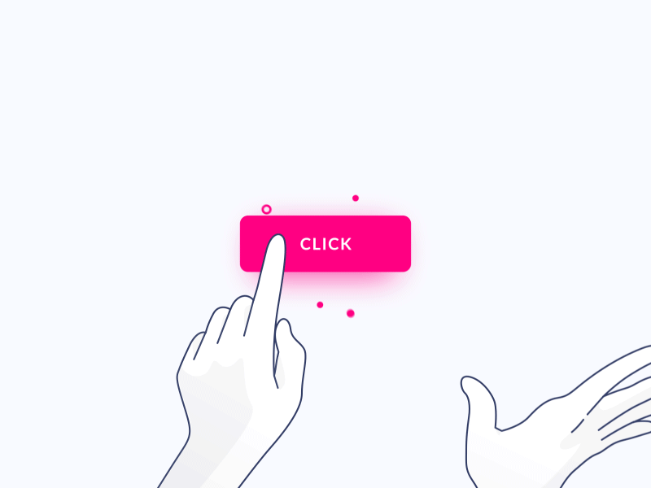

---
theme:
    override:
        code:
            theme_name: railsEnvy
        default:
            colors:
                background: "10141c"
---
<!-- column_layout: [1,1] -->
<!-- column: 0 -->
<!-- jump_to_middle -->
# Let's test our understanding
Mitsiu Alejandro Carreño Sarabia
<!-- column: 1 -->
<!-- new_line -->
<!-- new_line -->

<!-- end_slide -->
Agenda
===
├── Recap   
└── Exercises    

<!-- end_slide -->

# Recap
Before I forget 

<!-- end_slide -->
# Recap

I really want to encourage you to ask questions, so:
<!-- column_layout: [1,1] -->
<!-- column: 0 -->
I am offering two free tokens:
- To the person that remind's me to setup askqueue and share the link
- To the person that remind's me to check askqueue if an hour has passed and I havent checked
<!-- column: 1 -->

<!-- end_slide -->
# Recap
Learning material:
1. This slides
2. https://www.youtube.com/watch?v=WgJ2FUW1miA&list=PLuGpJqnV9DXq_ItwwUoJOGk_uCr72Yvzb
3. https://elmprogramming.com/
4. (Official guide) https://guide.elm-lang.org/
5. (Official docs) https://package.elm-lang.org/packages/elm/core/latest/
6. (Advanced level - Standard ML) https://www.youtube.com/watch?v=jjX68oHAw-Y&list=PLsydD1kw8jng2t2G8USQNLz0faYZetPnH
<!-- end_slide -->
# Recap
Our next tests:
- 2nd Partial = 30%
- - Class exercise / Homework = 10%
- - Theorical evaluation = 40%
- - Practical evaluation (paper based, NO computer!) = 50%

<!-- end_slide -->

